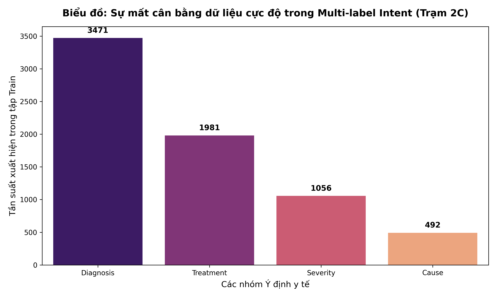

# 📐 Kiến trúc chi tiết: Medical Intent — Phân loại đa ý định y tế (Trạm 2C)

> **Module:** Trạm 2C — Medical Intent Classification (Multi-label, Multi-class)  
> **Backbone:** `demdecuong/vihealthbert-base-syllable` (RoBERTa-base, ~135M tham số)  
> **Chiến lược Loss (SOTA):** Asymmetric Loss (ASL) + Dynamic Thresholding  
> **Không gian nhãn:** 4 intents (Diagnosis, Treatment, Severity, Cause)

---

## 1. Tổng quan kiến trúc (Architecture Overview)

### 1.1 Mục tiêu của Trạm 2C
Khác với Trạm 2B (Topic Classification) là đơn nhãn loại trừ lẫn nhau, Trạm 2C giải quyết bài toán **Đa ý định (Multi-label)**. Một câu hỏi thực tế của bệnh nhân thường phức tạp và chứa nhiều mong muốn cùng lúc (ví dụ: vừa hỏi bệnh gì, vừa hỏi cách chữa, vừa hỏi có nguy hiểm không). 

Output của trạm là một vector xác suất cho từng nhãn. Việc trích xuất thành công các ý định này giúp hệ thống Prompt Engineering biết cách điều hướng LLM trả lời đúng trọng tâm.

### 1.2 Sơ đồ luồng dữ liệu

```mermaid
graph TD
    A[Văn bản thô] --> B[Syllable Tokenizer <br/> <i>Không word-segment</i>]
    B --> C[ViHealthBERT-Syllable <br/> <i>Encoder</i>]
    C --> D[Pooler Layer <br/> <i>CLS Token</i>]
    D --> E[Linear Head <br/> <i>K=4 Classes</i>]
    E --> F[Sigmoid Activation]
    F --> G{Multi-label Prediction <br/> <i>Dynamic Thresholding</i>}
    
    %% Loss mechanism
    H([Asymmetric Loss - ASL]) -.->|Phạt nặng lỗi trên nhãn hiếm| G
    
    style H fill:#021A54,stroke:#333,stroke-width:1px,stroke-dasharray: 5 5
```

---

## 2. Phân tích Dữ liệu (Exploratory Data Analysis - EDA)

### 2.1 Sự mất cân bằng dữ liệu cực độ (Extreme Imbalance)

**Nhận xét:** Biểu đồ phân bố cho thấy sự chênh lệch khủng khiếp giữa các nhãn. Nhãn `Diagnosis` (Chẩn đoán) áp đảo hoàn toàn, trong khi các nhãn như `Cause` (Nguyên nhân) và `Severity` (Mức độ nghiêm trọng) lại chiếm tỷ lệ rất nhỏ. Nếu sử dụng hàm Loss thông thường, mô hình sẽ rơi vào bẫy "Thiên kiến đa số" (Majority Bias) — tức là nó sẽ luôn đoán `0` cho các nhãn hiếm để an toàn hóa hàm mất mát.

---

## 3. Tầng dữ liệu: Xử lý Multi-label & Chuẩn hóa

### 3.1 Định dạng Multi-hot Encoding
Dữ liệu thô được chuẩn hóa tên nhãn và chuyển sang vector nhị phân $\mathbf{y} \in \{0, 1\}^K$ (với $K=4$). 
Ví dụ: Câu *"bệnh này chữa sao và có chết không?"* sẽ được mã hóa thành `[0, 1, 1, 0]` tương ứng với các ý định `[Diagnosis, Treatment, Severity, Cause]`.

### 3.2 Chiến thuật Adaptive Positive Weighting
Để trị tận gốc sự mất cân bằng, Trạm 2C tự động tính toán hệ số `pos_weight` cho từng class $c$ ngay trong Data Loader:

$$ \text{posweight}_c = \frac{N - N_c}{N_c} $$

Hệ số này sẽ được nhân vào hàm Loss của các mẫu Positive. Lớp càng hiếm (như Cause), hệ số phạt càng lớn (lên tới 13.23), ép mô hình phải "trân trọng" những lần học nhãn thiểu số.

---

## 4. Kiến trúc Mô hình SOTA (Model Architecture)

### 4.1 Backbone: ViHealthBERT-Syllable
Sử dụng phiên bản Syllable (âm tiết) thay vì Word-level. Lý do: Câu hỏi Intent thường mang tính hội thoại tự nhiên, có nhiều thán từ, trợ từ. Việc dùng Syllable giúp mô hình nhạy bén với cấu trúc câu hỏi Tiếng Việt mà không bị phụ thuộc vào sai số của các công cụ tách từ bên ngoài.

### 4.2 Hàm mất mát: Asymmetric Loss (ASL)
Đây là điểm chạm SOTA của kiến trúc. Thay vì dùng `BCEWithLogitsLoss` truyền thống, hệ thống áp dụng ASL chuyên trị Multi-label imbalanced:

* **Down-weighting Easy Negatives:** Cắt giảm sự đóng góp của các nhãn Negative quá dễ đoán (như Diagnosis).
* **Hard Positive Mining:** Tăng cường Gradient cho các nhãn Positive khó đoán (như Severity, Cause).

Sự kết hợp này giúp các nhãn không phải cạnh tranh xác suất với nhau (như Softmax), mà được tối ưu hóa một cách độc lập và công bằng.

---

## 5. Đánh giá & Tối ưu hóa (Evaluation & Optimization)

### 5.1 Thuật toán Dynamic Thresholding
Thay vì dùng ngưỡng $0.5$ cố định cứng ngắc cho tất cả các nhãn, mô hình tích hợp thuật toán tự động quét ngưỡng trên tập Validation. 
Đặc biệt đối với nhãn rủi ro cao như `Severity` (Nguy hiểm), thuật toán đã tự động đẩy ngưỡng (Threshold) lên mức **$0.80$**. Điều này đảm bảo mô hình phải thực sự chắc chắn $>80\%$ thì mới được phép kích hoạt nhãn này, giúp giảm thiểu tối đa báo động giả (False Positive) trong tư vấn y tế.

### 5.2 Metrics Đánh giá
Sử dụng các chỉ số khắt khe:
- **Macro-F1 (0.9688):** Đánh giá công bằng cho mọi nhãn. F1 của nhãn cực hiếm (Cause) đạt tới $0.9941$, chứng minh ASL hoạt động xuất sắc.
- **Micro-F1:** Đánh giá hiệu năng tổng thể trên toàn bộ dự đoán.
