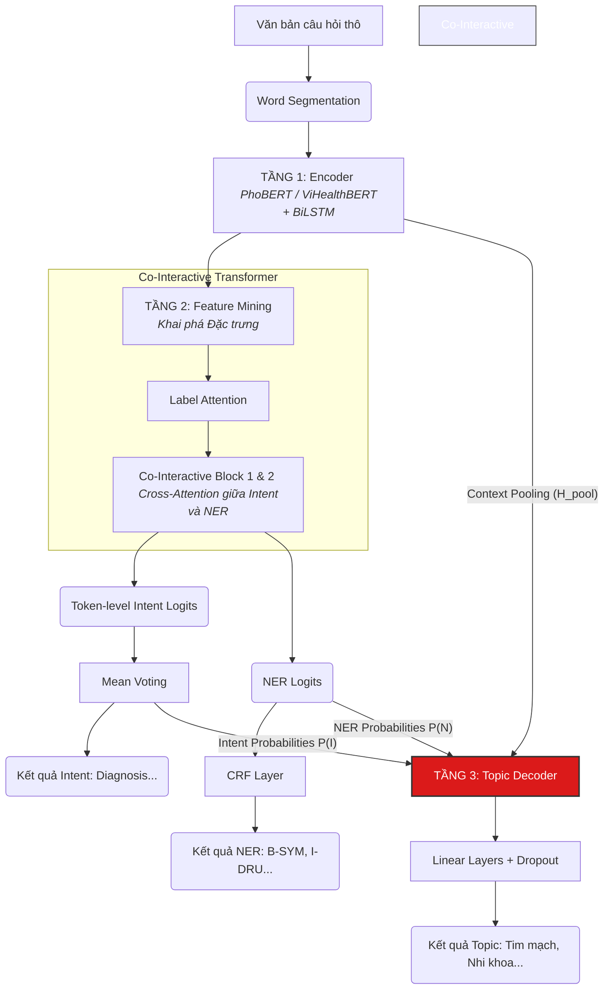

# 📐 Kiến trúc chi tiết: Knowledge-Enhanced Hierarchical Network (KEHN)

> **Module:** Joint Learning (Topic + Intent + NER)
> **Backbone:** `vinai/phobert-base-v2` hoặc `demdecuong/vihealthbert-base-word`
> **Kỹ thuật SOTA:** Co-Interactive Transformer, Stack-Propagation, Curriculum Learning
> **Mục tiêu:** Nâng cao hiệu suất phân loại Chuyên khoa (Topic) bằng cách ép mô hình học cách khai phá đặc trưng ngữ nghĩa ẩn từ Ý định (Intent) và Thực thể y tế (NER).

---

## 1. Tổng quan Kiến trúc (Architecture Overview)

Truyền thống, các bài toán Topic, Intent, và NER thường được giải quyết bằng mô hình dạng đường ống (Pipeline) hoặc chia sẻ bộ mã hóa đơn giản (Shared-Encoder). Nhược điểm của chúng là:
1. Thiếu sự tương tác qua lại giữa các tác vụ (Intent và NER có mối quan hệ rất chặt chẽ).
2. Lỗi từ tác vụ này lan truyền sang tác vụ khác một cách mất kiểm soát.

Kiến trúc **KEHN (Knowledge-Enhanced Hierarchical Network)** giải quyết triệt để vấn đề này bằng một thiết kế phân tầng (Hierarchical) gồm 3 cấp độ, được tổng hợp từ 3 nghiên cứu SOTA: **OneNet** (2017), **Stack-Propagation** (2019), và **DCA-Net** (2021).

### Sơ đồ Luồng Dữ Liệu (Data Flow)

---

## 2. Phân tích Chi tiết 3 Tầng Kiến Trúc

### 2.1. Tầng 1: Mã hóa Ngữ cảnh (Context Encoder)
Đầu vào là văn bản tiếng Việt đã được tách từ (Word Segmentation). 
- **Backbone:** Sử dụng `PhoBERT` hoặc `ViHealthBERT` để trích xuất ngữ cảnh tĩnh (Static Context). 
- **BiLSTM:** Kết quả của BERT được đẩy qua 1 lớp Bidirectional LSTM để tăng cường nắm bắt sự phụ thuộc xa (long-term dependencies) trong câu hỏi y tế phức tạp.
- **Output:** Ma trận ẩn $\mathbf{H} \in \mathbb{R}^{L \times d}$ (với $L$ là độ dài chuỗi, $d=768$).

### 2.2. Tầng 2: Khai phá Đặc trưng (Feature Mining Layer)
Đây là "trái tim" của sự tương tác đa nhiệm, giải quyết bài toán NER và Intent.

**A. Label Attention (Sự chú ý nhãn)**
Thay vì dùng trực tiếp $\mathbf{H}$, mô hình sử dụng trọng số của lớp Linear cuối cùng làm Label Embeddings, tạo ra các đặc trưng ẩn chuyên biệt: $\mathbf{H}_{intent}$ và $\mathbf{H}_{ner}$.

**B. Co-Interactive Transformer (Tương tác hai chiều)**
Intent và NER không hề độc lập (ví dụ: có thực thể `B-DRU` - Thuốc thì khả năng cao Intent là `Treatment` - Cách chữa). 
- $\mathbf{H}_{intent}$ dùng làm Query để trích xuất thông tin từ $\mathbf{H}_{ner}$ (Key, Value).
- Ngược lại, $\mathbf{H}_{ner}$ dùng làm Query để trích xuất thông tin từ $\mathbf{H}_{intent}$.
Qua 2 khối Co-Interactive Block, cả Intent và NER đều được "nhúng" (enrich) kiến thức của nhau.

**C. Token-level Intent (Stack-Propagation)**
Thay vì dự đoán Intent cho cả câu (dễ mất thông tin cục bộ), KEHN dự đoán Intent cho **từng từ** (Token-level). Sau đó dùng phép Mean Voting để chốt lại Intent cuối cùng cho cả câu.

### 2.3. Tầng 3: Giải mã Chuyên khoa (Stack-Propagation Topic Decoder)
Đây là bài toán trọng tâm (Primary Task) của Data Mining. Tầng này nhận đầu vào là sự kết nối (Concatenation) của 3 luồng thông tin:
1.  **Đặc trưng ngữ nghĩa:** Context vector $\mathbf{H}_{pool}$ (Max-pooling từ Tầng 1).
2.  **Đặc trưng Ý định:** Phân phối xác suất Ý định $\mathbf{P}(Intent)$ (4 chiều).
3.  **Đặc trưng Thực thể:** Phân phối xác suất NER $\mathbf{P}(NER)$ đã được max-pool (7 chiều).

**Ý nghĩa:** Bằng cách "bơm" trực tiếp xác suất của Intent và NER vào Topic Decoder, mô hình Topic không phải tự mình "mò mẫm" tìm đặc trưng bệnh học, mà được thừa hưởng trực tiếp "tri thức y khoa" (Knowledge-Enhanced) đã được khai phá kỹ lưỡng ở Tầng 2.

---

## 3. Chiến lược Huấn luyện SOTA

### 3.1. Curriculum Learning (Học theo Giáo trình)
Việc ép mô hình học 3 bài toán khó cùng lúc từ vạch xuất phát sẽ dẫn đến "thảm họa phân kỳ" (Loss không giảm). Lấy cảm hứng từ OneNet, KEHN được huấn luyện theo 4 giai đoạn tiến hóa:

*   **Phase 1 (Epoch 1-3) - Topic Only:** Khóa (Freeze) toàn bộ Tầng 2. Ép Tầng 1 tập trung học biểu diễn chung cho bài toán phân loại chuyên khoa.
*   **Phase 2 (Epoch 4-6) - Mining Only:** Khóa Tầng 3. Ép Tầng 2 học cách trích xuất Intent và NER cho thật sắc bén.
*   **Phase 3 (Epoch 7-10) - Joint without Propagation:** Mở khóa toàn bộ. Cho 3 tác vụ học chung, nhưng *chưa* truyền xác suất Intent/NER lên Topic (chỉ dùng chung Tầng 1).
*   **Phase 4 (Epoch 11-30) - Full Stack-Propagation:** Bật luồng truyền thông tin. Bắt Topic Decoder phải phân loại dựa trên cả Context lẫn phân phối Ý định/Thực thể.

### 3.2. Xử lý Mất Cân Bằng Lớp (Extreme Class Imbalance)
Dữ liệu y tế có sự chênh lệch khủng khiếp (Nội khoa: >1000 mẫu, Y học cổ truyền: 1 mẫu). 
Giải pháp: Áp dụng **Weighted Cross-Entropy Loss** cho nhánh Topic. Trong quá trình tiền xử lý, hệ thống tự động tính hệ số phạt (Penalty weights) tỷ lệ nghịch với số lượng mẫu. Lớp càng hiếm, loss càng lớn, ép mô hình phải chú ý học tập.

### 3.3. Hàm Mất Mát Đa Nhiệm (Joint Loss)
Hàm mục tiêu cuối cùng trong Phase 4 là sự kết hợp có trọng số của 3 hàm Loss riêng lẻ:
$$ L_{joint} = 0.5 \cdot L_{topic\_weighted\_CE} + 0.3 \cdot L_{intent\_token\_CE} + 0.2 \cdot L_{ner\_crf} $$

Trọng số cao nhất ($0.5$) được ưu tiên cho tác vụ chính yếu của đồ án: Phân loại Chuyên khoa (Topic Classification).
