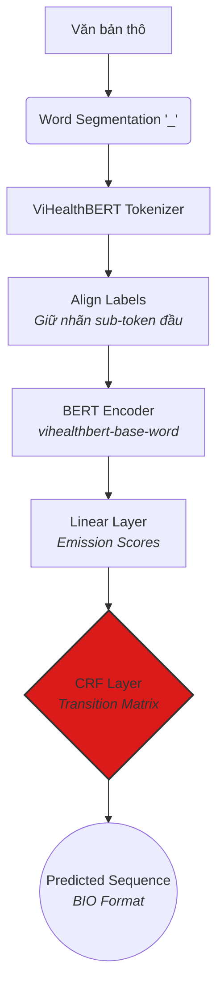
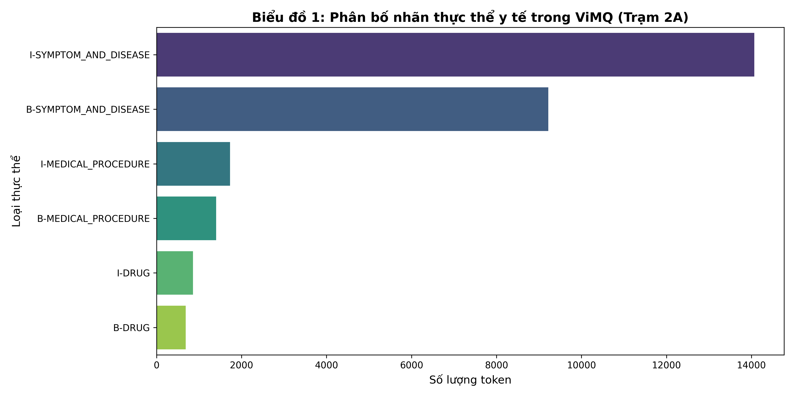
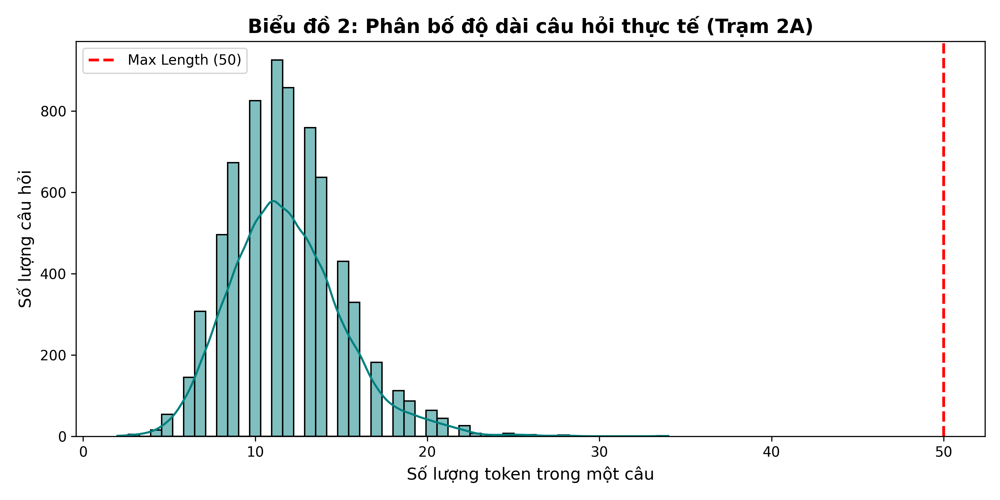

# 📐 Kiến trúc chi tiết: Medical NER — Trích xuất thực thể y tế (Trạm 2A)

> **Module:** Trạm 2A — Medical Named Entity Recognition (Token Classification)  
> **Backbone:** `demdecuong/vihealthbert-base-word` (RoBERTa-base, word-level)  
> **Tầng bổ trợ (SOTA):** CRF (Conditional Random Fields)  
> **Không gian nhãn:** BIO format (SYMPTOM_AND_DISEASE, MEDICAL_PROCEDURE, MEDICINE)  
> **Mục tiêu:** Giải quyết triệt để vấn đề span-noise và luật chuyển nhãn trong văn bản y tế để cấp từ khóa chuẩn cho Semantic Retriever.

---

## 1. Tổng quan kiến trúc (Architecture Overview)

### 1.1 Mục tiêu của Trạm 2A
Trạm 2A nhận đầu vào là các câu hỏi thô đã được word-segmented (tách từ bằng dấu `_`). Nhiệm vụ là gán nhãn cho từng token để trích xuất chính xác các thực thể y tế quan trọng phục vụ cho các trạm phía sau (như RAG hoặc tìm kiếm chuyên khoa). 

Khác với các bài toán phân loại thông thường, NER là **Sequence Labeling**. Độ chính xác không chỉ nằm ở việc đoán đúng loại thực thể, mà còn phải đúng ranh giới (`B-` hay `I-`) để tạo thành một cụm hoàn chỉnh.

### 1.2 Sơ đồ luồng dữ liệu (Data Flow)

---

## 2. Phân tích Dữ liệu (Exploratory Data Analysis - EDA)

Để xây dựng chiến lược huấn luyện tối ưu, dữ liệu ViMQ NER đã được phân tích chuyên sâu nhằm tìm ra các đặc trưng phân bố và điểm mù.

### 2.1 Phân bố nhãn thực thể (Entity Distribution)

**Nhận xét:** Sự phân bố thực thể mang tính đặc thù y tế cao, trong đó nhãn Bệnh lý và Triệu chứng chiếm tỷ trọng cực kỳ áp đảo so với Thuốc và Thủ thuật y tế. Tỷ lệ lệch nhãn này đòi hỏi bộ đánh giá phải dùng metric **Strict F1-score** thay vì Accuracy thông thường.

### 2.2 Phân bố độ dài chuỗi (Sequence Length Analysis)

**Nhận xét:** Phân tích đồ thị Histogram độ dài sau khi tokenize cho thấy phần lớn (>99%) câu hỏi của bệnh nhân nằm trong khoảng dưới 200 tokens. Điều này là cơ sở kỹ thuật vững chắc để chốt tham số **`max_length = 256`** trong DataLoader, giúp tối ưu hóa bộ nhớ GPU (VRAM) mà không lo rủi ro mất mát thông tin (truncation) của các câu dài.

---

## 3. Tầng Dữ liệu: Tiền xử lý & Xử lý nhiễu

### 3.1 Xử lý ranh giới Sub-token (Label Alignment)
Vì Backbone sử dụng từ điển Word-level, Tokenizer của Hugging Face sử dụng thuật toán BPE có thể cắt một từ phức thành các sub-tokens lẻ (vd: "đau_đầu" -> "đau_@@", "đầu"). 
**Chiến lược xử lý (Bypass `word_ids` error):**
- Chỉ gán nhãn gốc cho sub-token đầu tiên của từ.
- Các sub-token đi sau bị ép thành nhãn `-100` (thuật toán tự động bỏ qua tính Loss cho nhãn này), giúp mô hình không bị nhiễu loạn ngữ nghĩa nội tại.

### 3.2 Chiến thuật trị Span-Noise (Nhiễu ranh giới)
Dữ liệu ViMQ gốc tồn tại nhiều lỗi gán nhãn lệch index do con người tạo ra. Thay vì tốn thời gian dọn nhiễu thủ công, Trạm 2A triển khai thiết kế **CRF** như một "bộ lọc ngữ pháp" tự động uốn nắn lại các ranh giới lỗi trong quá trình hội tụ.

---

## 4. Kiến trúc Mô hình SOTA (Model Architecture)

### 4.1 Backbone: ViHealthBERT-word
Sử dụng `vihealthbert-base-word` đã được pre-train trên hàng chục GB văn bản y khoa Tiếng Việt. Output của lớp Encoder cuối cùng là một khối tensor $\mathbf{H} \in \mathbb{R}^{L \times d}$ (với $L$ là độ dài chuỗi, $d=768$).

### 4.2 Tầng CRF (Conditional Random Fields) - Đột phá kiến trúc
Thay vì dùng Softmax hoặc Linear + CrossEntropy tính lỗi rời rạc cho từng từ, kiến trúc được ghép nối với lớp CRF nhằm tối ưu hóa xác suất đồng thời cho **toàn bộ chuỗi nhãn** $\mathbf{y}$:

$$ P(\mathbf{y} | \mathbf{x}) = \frac{1}{Z(\mathbf{x})} \exp \left( \sum_{i=1}^{L} \mathbf{E}_{i, y_i} + \sum_{i=1}^{L-1} \mathbf{T}_{y_i, y_{i+1}} \right) $$

**Giá trị cốt lõi:** Ma trận chuyển đổi (Transition Matrix $\mathbf{T}$) trong CRF sẽ tự động trừng phạt các kết quả bất hợp lý. Nó triệt tiêu xác suất (đưa $P \approx 0$) đối với những chuỗi lỗi ngữ pháp BIO như từ `O` chuyển thẳng sang `I-MEDICINE`, bảo toàn cấu trúc chuỗi đầu ra.

---

## 5. Quá trình Huấn luyện & Đánh giá (Training & Evaluation)

### 5.1 Chiến lược Hội tụ & Dừng sớm (Early Stopping)
Quá trình huấn luyện được thiết lập cơ chế giám sát chặt chẽ thông qua `EarlyStoppingCallback(patience=3)` nhằm tự động ngắt tiến trình khi phát hiện dấu hiệu học vẹt (Overfitting). 

Thực tế huấn luyện (Training Logs) cho thấy:
- Mô hình đạt đỉnh hội tụ (Best Checkpoint) rất nhanh với F1-score xấp xỉ **0.80**.
- Ở các epoch tiếp theo, mặc dù `Training Loss` tiếp tục giảm (mô hình cố gắng học thuộc lòng dữ liệu Train), nhưng `Validation Loss` lại có dấu hiệu tăng ngược trở lại. Ngay lập tức, cơ chế Dừng sớm đã tự động cắt ngang tiến trình, loại bỏ các epoch bị nhiễu và khôi phục lại bộ trọng số (weights) tối ưu nhất. Điều này đảm bảo mô hình giữ được khả năng tổng quát hóa (generalization) cao nhất khi đối mặt với dữ liệu thực tế.

### 5.2 Metrics Đánh giá chuyên sâu
Hệ thống sử dụng thư viện `seqeval` chuẩn quốc tế dành riêng cho bài toán Sequence Labeling để đánh giá:
- **Strict F1-score (~80%):** Đây là thước đo vô cùng khắt khe. Một thực thể chỉ được tính là dự đoán đúng (Exact Match) khi và chỉ khi nó khớp 100% cả về danh tính (Bệnh/Thuốc) lẫn ranh giới từ (`B-` và `I-`). Việc đạt được mức F1 này trên dữ liệu y tế phức tạp minh chứng cho sức mạnh bộ lọc của CRF.
- **Precision & Recall:** Thể hiện sự cân bằng tuyệt vời giữa việc "không bỏ sót thực thể y tế quan trọng" (Recall cao) và "không dự đoán bừa bãi gây nhiễu context" (Precision cao).
