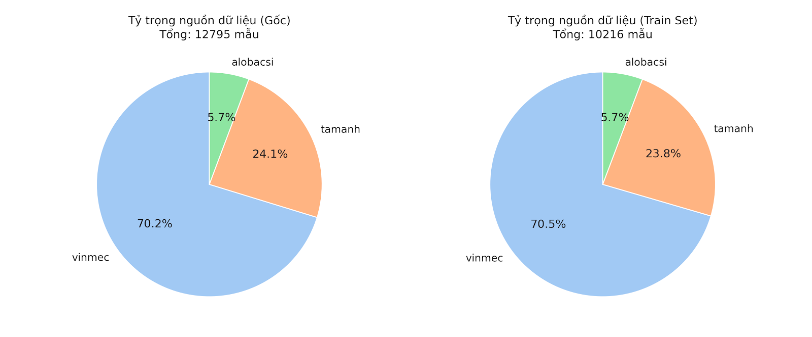
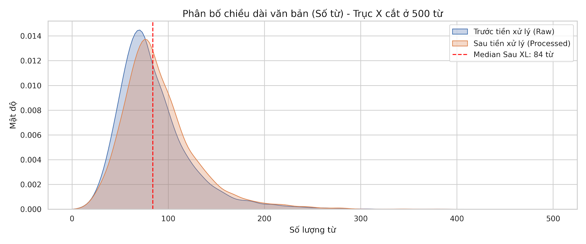
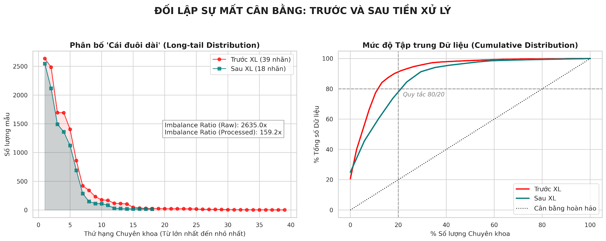

# 📐 Kiến trúc Chi tiết: Topic Classification — Phân loại Chuyên khoa Y tế (Trạm 2B)

> **Module:** Trạm 2B — Medical Topic Classification (Single-label, Multi-class)  
> **Backbone:** `demdecuong/vihealthbert-base-syllable` (RoBERTa-base, ~135M tham số)  
> **Không gian nhãn:** **18** chuyên khoa chuẩn (*Canonical Topics*)  
> **Dữ liệu nguồn (thô):** Alobacsi, Vinmec `train_ml`, Tâm Anh (sau khi đồng nhất & lọc)  
> **Kết quả tham chiếu:** Accuracy tổng thể **~92.25%** (validation/test theo cấu hình huấn luyện hiện tại)

---

---

## 1. Hồ sơ Dữ liệu & Phân tích Khám phá (EDA)

Trước khi đi vào thiết kế hệ thống, việc hiểu rõ bản chất của tập dữ liệu là tiên quyết. Trạm 2B xử lý các truy vấn y tế từ người dùng cuối, mang đậm tính hội thoại và nhiễu loạn. Dưới đây là 3 góc nhìn cốt lõi quyết định kiến trúc của hệ thống.

### 1.1 Cơ cấu Nguồn Dữ liệu (Source Distribution)
Dữ liệu thô của hệ thống được thừa hưởng từ 3 nền tảng y khoa lớn nhất Việt Nam:
- **Vinmec** (chiếm >60%): Đóng vai trò xương sống với lượng dữ liệu khổng lồ từ bộ `train_ml`.
- **Tâm Anh** (~30%): Bổ sung các ca bệnh khó và chuyên khoa sâu.
- **AloBacsi** (<10%): Cung cấp phong cách ngôn ngữ hỏi đáp (Q&A) bình dân và đa dạng của bệnh nhân.

> **💡 Insight:** Sự pha trộn đa nguồn này là mũi giáo sắc bén chống lại hiện tượng "học vẹt". Việc mô hình tiếp xúc với nhiều văn phong, từ ngữ địa phương và cách diễn đạt khác nhau từ 3 bệnh viện giúp **tăng cường tối đa khả năng tổng quát hóa (generalization)** khi đối mặt với người dùng thực tế.



### 1.2 Phân bố Chiều dài Văn bản (Text Length Analysis)
Sau bước làm sạch cơ bản (chuẩn hóa Unicode, loại bỏ HTML, xóa các câu chào hỏi kiểu *"Thưa bác sĩ"* hay *"Chào chuyên gia"*), phân bố độ dài văn bản lộ diện:
- Chiều dài trung bình và trung vị (median) hội tụ ở mức **71 từ** (tương đương khoảng 100-110 âm tiết/syllables tùy cách đo).
- Phần đuôi của phân phối dài (long-tail) chứa các ca bệnh phức tạp mô tả dài dòng.

> **💡 Insight:** Phân phối lệch phải (right-skewed) này khẳng định việc cấu hình `max_length = 256` cho ViHealthBERT (vốn tokenize theo âm tiết) là cực kỳ tối ưu — một "điểm rơi ngọt ngào" (Sweet Spot). Cấu hình này đủ lớn để **bao trọn >95%** các câu hỏi mà không làm cắt cụt các triệu chứng quan trọng thường được bệnh nhân liệt kê ở cuối câu, đồng thời tránh lãng phí RAM / VRAM tính toán vô ích cho các padding thừa.



### 1.3 Thách thức Tối thượng: Phân mảnh & Mất cân bằng (Fragmentation & Imbalance)
Đây là rào cản chí mạng nhất đối với bất kỳ mô hình phân loại đa lớp nào trên miền y tế.

- **Sự phân mảnh (Fragmentation):** Dữ liệu gốc ghi nhận tới **39 nhãn chuyên khoa** với sự chồng lấn ngữ nghĩa cực kỳ nghiêm trọng. Ví dụ: `neurosurgery` (ngoại thần kinh) và `neurology` (nội thần kinh) phân tách quá nhỏ; `hepatology` (gan mật) lại nằm ngoài `gastroenterology` (tiêu hóa). Do đó, bước **Canonical Mapping** (gộp về 18 nhãn lõi) là yêu cầu sống còn để tạo ra ranh giới (decision boundary) đủ sắc nét cho mô hình học.

- **Sự thật về Mất cân bằng (The Imbalance Reality):**
  - Tuân theo triệt để quy luật Pareto (Đường cong Lorenz): Chỉ khoảng 20% số khoa (Sản, Nhi, Tim mạch, Cơ xương khớp) đã **chiếm trọn >80%** tổng lượng dữ liệu của toàn hệ thống.
  - Khi gộp về 18 nhãn chuẩn, **tỷ lệ mất cân bằng (Imbalance Ratio) vọt lên mức 159.2x**. Điển hình: Khoa Sản (Obstetrics/Gynecology) sở hữu 2.548 câu, trong khi Khoa Dinh dưỡng (Nutrition) chỉ có vỏn vẹn 16 câu.

> **💡 Insight:** Sự thật khắc nghiệt này làm tiền đề giải thích **tại sao ta không thể dùng Cross Entropy thông thường**. Nó bắt buộc tầng Model (Model Architecture) phải triển khai `Weighted Trainer` (Weighted Loss) để ép mô hình chú ý vào nhóm thiểu số, đồng thời là động lực nòng cốt sinh ra Phase 2: **Self-Training (FAQ Augmentation)** nhằm "cứu rỗi" các khoa hiếm một cách hệ thống.



---

## 2. Tổng quan Kiến trúc (Architecture Overview)

### 2.1 Mục tiêu của Trạm 2B

**Trạm 2B** nhận đầu vào là **câu hỏi / mô tả triệu chứng y tế thô** (tiếng Việt, có thể chứa nhiễu định dạng, tiền tố hội thoại, dấu gạch dưới từ word-segmentation, v.v.) và xuất ra:

- Một **chuyên khoa lâm sàng** được chuẩn hóa trong tập **18 nhãn cố định** (*canonical topics*), ví dụ: `cardiology`, `gastroenterology`, `pediatrics`, …  
- Các nhãn này **không phải** là taxonomy đầy đủ của bệnh viện thực tế, mà là **lớp trừu tượng ổn định** để downstream (routing FAQ, gợi ý bác sĩ, RAG theo khoa) hoạt động nhất quán trên toàn pipeline NLU.

Khác với Trạm 1 (WSD dạng *pairwise scoring*), Trạm 2B là bài toán **phân loại đa lớp loại trừ lẫn nhau** (*mutually exclusive multi-class*): mỗi câu gán **đúng một** `topic_id ∈ {0, …, 17}`.

### 2.2 Sơ đồ Luồng Dữ liệu Tổng thể

Luồng end-to-end từ dữ liệu thô đến mô hình triển khai có thể tóm tắt như sau:

```
┌──────────────────────────────────────────────────────────────────────────┐
│                    TOPIC PIPELINE — DATA → MODEL                           │
├──────────────────────────────────────────────────────────────────────────┤
│                                                                          │
│  ① RAW SOURCES (3 nguồn)                                                 │
│     CSV / bảng: Alobacsi | Vinmec train_ml | Tâm Anh                     │
│          │                                                               │
│          ▼                                                               │
│  ② PREPROCESS (preprocess_topic.py)                                    │
│     • Chuẩn hóa text (NFC, loại boilerplate, ghép title/body…)           │
│     • CANONICAL MAPPING: gộp nhãn phân mảnh → 18 topic                   │
│     • Lọc class quá hiếm / ngoài phạm vi lâm sàng (DROP)                 │
│     • Stratified split → topic_train.json | topic_val.json | topic_test  │
│     • topic_label_map.json (topic2id / id2topic)                         │
│          │                                                               │
│          ├──────────────────────┬──────────────────────────────────────┐
│          ▼                      ▼                                      ▼   │
│  ③ OPTIONAL AUGMENT          (FAQ Silver — augment_faq_topics.py)       │
│     • Làm sạch FAQ (desegment _, regex boilerplate, độ dài tối thiểu)    │
│     • Teacher model → pseudo-label                                     │
│     • DOUBLE-FILTER: confidence cao ∧ chỉ TARGET minority classes       │
│     • Merge → topic_train_augmented.json (hoặc thay thế train)           │
│          │                                                               │
│          ▼                                                               │
│  ④ TRAINING (train_topic.py)                                             │
│     • TopicDataLoader: tokenize syllable, NO static max padding          │
│     • Class weights w_c trên tập train (imbalance)                       │
│     • DataCollatorWithPadding + WeightedTrainer (weighted CE)            │
│     • Best checkpoint theo validation; cuối cùng evaluate HOLD-OUT TEST  │
│          │                                                               │
│          ▼                                                               │
│  ⑤ ARTIFACTS                                                             │
│     • Fine-tuned ViHealthBERT + head 18 logits                           │
│     • topic_label_mapping.json / id2topic đồng bộ pipeline               │
│                                                                          │
└──────────────────────────────────────────────────────────────────────────┘
```

> **Điểm then chốt:** Toàn bộ “ý nghĩa nghiệp vụ” của khoa được **khóa** trong lớp **Canonical Mapping + label map cố định**. Mọi bước sau (huấn luyện, pseudo-label, metric) chỉ hợp lệ nếu cùng một `topic_label_map.json`.

---

## 3. Tầng 1: Tiền xử lý & Chiến lược Dữ liệu (Data Engineering Layer)

### 3.1 Canonical Mapping — Đồng nhất nhãn phân mảnh

Trong thực tế, ba nguồn dữ liệu dùng **bảng phân loại nội bộ khác nhau** (tên khoa dài, trùng ý, hoặc quá chi tiết so với mục tiêu 18 lớp). **Canonical Mapping** là quy tắc ánh xạ deterministíc:

- **Gộp** các nhãn “gần nghĩa lâm sàng” về một topic mục tiêu.  
  Ví dụ điển hình trong thiết kế pipeline:
  - `neurosurgery` → `neurology` (cùng phạm vi thần kinh trong ngữ cảnh FAQ)
  - `hepatology` → `gastroenterology` (gan–mật–tụy thuộc tiêu hóa)
  - `neonatology` → `pediatrics` (sơ sinh là nhánh nhi khoa)
  - `otolaryngology` → `ent` (TMH)

- **DROP** các nhãn quá hiếm hoặc không còn là “khoa lâm sàng” rõ ràng sau khi gộp (ví dụ: `radiology`, `laboratory`, `research` với rất ít mẫu), để tránh **học nhiễu** và **metric lệch** trên lớp không đủ đại diện thống kê.

**Triết lý:** Ta ưu tiên **ổn định nhãn và khả năng tái lập** (reproducible taxonomy) hơn là giữ nguyên toàn bộ nhãn gốc từ từng bệnh viện — điều này là tiền đề để mô hình học được ranh giới ngữ nghĩa giữa các khoa ở mức “đủ rộng để phân biệt”, không quá mịn đến mức dữ liệu không đủ.

### 3.2 Xử lý mất cân bằng tĩnh — Class weights trên tập Train

Sau khi gộp nhãn, phân bố lớp trên tập **train** thường **cực kỳ lệch** (một số khoa chiếm phần lớn mẫu, một số khoa chỉ vài chục câu). Nếu chỉ tối ưu **Cross-Entropy không trọng số**, gradient sẽ bị thống trị bởi các lớp đa số — các lớp thiểu số dễ bị “bỏ quên” dù accuracy tổng thể vẫn cao.

**Trọng số lớp** được tính **chỉ từ tập train** theo công thức cân bằng kiểu inverse frequency (một dạng “effective sample reweighting”):

$$
w_c = \frac{N}{C \cdot N_c}
$$

Trong đó:

- $N$: tổng số mẫu trong tập train  
- $C$: số lớp (ở đây $C = 18$)  
- $N_c$: số mẫu thuộc lớp $c$ trong train  

**Ý trực giác:** Lớp có $N_c$ nhỏ → $w_c$ lớn → đóng góp vào loss lớn hơn → optimizer bị “ép” chú ý tới các mẫu hiếm.  
Trong triển khai, để tránh chia cho 0 khi đếm lỗi, người ta thường **clamp** $N_c$ tối thiểu (ví dụ $\max(N_c, 1)$) — đây là chi tiết kỹ thuật nhỏ nhưng cần thiết cho ổn định số học.

> **Cảnh báo:** Class weight **không thay thế** việc có đủ tín hiệu ngữ nghĩa cho lớp hiếm. Nếu một khoa chỉ có vài chục câu *và* phần lớn là nhiễu / trùng lặp, weight chỉ “kéo” mô hình khỏi bỏ qua hoàn toàn, chứ **không tạo ra tri thức mới**.

### 3.3 Chiến dịch “Cứu rỗi khoa hiếm” — FAQ & Strict Pseudo-Labeling (Phase 2)

#### 3.3.1 Triết lý Self-Training trên FAQ

Một nguồn bổ sung điển hình là **kho FAQ lớn** (thường $\sim 10^4$ câu), mang tính **đa dạng diễn đạt** nhưng **không có nhãn khoa tin cậy**. Ta dùng một **teacher model** (mô hình topic đã huấn luyện trước) để gán nhãn giả (*pseudo-labels*), rồi chỉ hợp nhất một phần nhỏ **chất lượng cao** vào train — đây là dạng **self-training có kiểm soát**.

#### 3.3.2 Màng lọc kép (Double-Filter)

Để pseudo-label không làm bẩn tập huấn luyện, pipeline áp dụng **hai điều kiện đồng thời**:

1. **Độ tin cậy cực cao theo softmax:** chỉ giữ mẫu khi xác suất lớp dự đoán $\hat{p}_{\hat{y}} \ge \tau$ với $\tau$ thường chọn **0.95**.  
   - Lý do: pseudo-label chỉ an toàn khi phân phối softmax “đỉnh và hẹp” — tức mô hình teacher không còn mơ hồ giữa các lớp gần nhau.

2. **Giới hạn tập lớp đích (*Target Classes*):** chỉ chấp nhận các khoa được xếp vào danh sách **thiểu số / cần bổ sung** (ví dụ: `ent`, `dermatology`, `endocrinology`, …), **cố ý loại** các khoa đa số kiểu “Nhi / Sản / Chấn thương chỉnh hình / Tim mạch” nếu chiến lược là tránh nhồi thêm dữ liệu cho lớp vốn đã đủ lớn.

**Tại sao phải kết hợp cả hai?**

- Nếu chỉ lọc theo **confidence**: teacher có thể rất “chắc” nhưng **chắc sai** trên miền FAQ (domain shift), hoặc đẩy quá nhiều mẫu vào vài lớp “dễ ăn” → **lệch phân bố**.  
- Nếu chỉ lọc theo **target list** mà không có confidence: sẽ nhập **nhiễu nhãn** với tỷ lệ cao.  
- Kết hợp hai lớp lọc giảm mạnh xác suất “thêm đúng số lượng nhưng sai nội dung”.

#### 3.3.3 Cảnh báo: Imbalance Amplification (khuếch đại mất cân bằng)

> **Cảnh báo (Imbalance Amplification):** Nếu pseudo-labeling để lọt các câu thực chất thuộc **khoa đa số** (ví dụ Nhi / Sản) nhưng bị gán nhầm sang khoa hiếm, hoặc nếu ta vô tình thu thập quá nhiều FAQ “dễ” nghiêng về một vài khoa, train sẽ **càng lệch** — accuracy tổng thể vẫn có thể đẹp, nhưng **F1 từng lớp** và **macro-F1** sẽ báo động.  
> Do đó, **target-class filter** không chỉ là “tiết kiệm dung lượng”, mà là **van an toàn** chống bão hòa lớp đã đủ lớn.

#### 3.3.4 Tiền xử lý FAQ phục vụ syllable tokenizer

Vì backbone tokenize theo **âm tiết**, các dấu `_` kiểu word-segmentation cần được **quy về khoảng trắng**; đồng thời loại các mở đầu kiểu hội thoại (“Chào bác sĩ”, …) để không chiếm quota ngữ cảnh. Đây là bước “làm sạch miền” (*domain cleaning*) trước khi teacher nhìn thấy câu.

---

## 4. Tầng 2: Kiến trúc Mô hình (Model Architecture & Computation)

### 4.1 Backbone: ViHealthBERT-Syllable

**`demdecuong/vihealthbert-base-syllable`** là encoder RoBERTa-style pretrained trên corpus y tế tiếng Việt. Đặc điểm quan trọng với Trạm 2B:

- **Tokenizer theo âm tiết** (*syllable-level*): phù hợp tiếng Việt không có khoảng trắng tự nhiên giữa từ, và **không yêu cầu** chuỗi đầu vào mang marker `_` như một số pipeline word-level.  
- Miền đầu vào sau tiền xử lý nên là **văn bản “sạch”** theo nghĩa lâm sàng–hội thoại, không phụ thuộc vào công cụ tách từ bên ngoài.

| Thông số | Giá trị (tham chiếu kiến trúc base) |
|---|---|
| Hidden size ($d$) | 768 |
| Số lớp Transformer | 12 |
| Số heads Attention | 12 |
| Đầu ra phân loại (sau fine-tune) | $K = 18$ logits |

### 4.2 Forward Pass — Từ token hóa đến logits 18 lớp

#### (A) Tokenization & Dynamic Padding

Trong huấn luyện, pipeline **không** cố định độ dài bằng *max padding* cho toàn dataset (tránh lãng phí bộ nhớ và ép batch chứa nhiều token **padding** vô ích). Thay vào đó:

- Mỗi mẫu được tokenize với **truncation** theo giới hạn (ví dụ $L_{\max}=256$), **không** pad cứng tới $L_{\max}$ ngay từ khâu dataset.  
- Khi ghép batch, **DataCollatorWithPadding** pad theo **độ dài thực tế lớn nhất trong batch** → tensor đầu vào có dạng:

$$
\mathbf{X} \in \mathbb{R}^{B \times L_{\text{batch}} \times d}
$$

với $L_{\text{batch}} \le L_{\max}$.

> **Ý nghĩa:** *Dynamic padding* giảm số phép tính attention trên token pad, cải thiện throughput và giảm “nhiễu” do chuỗi quá dài nhưng phần lớn là pad — đặc biệt quan trọng khi phân bố độ dài câu hỏi y tế rất lệch.

#### (B) Self-Attention qua 12 tầng Encoder

Cho embedding đầu vào $\mathbf{E}^{(0)}$, mỗi tầng $l = 1..12$ thực hiện khối attention + FFN chuẩn Transformer. Ở dạng tổng quát (single-head để diễn giải):

$$
\mathrm{Attention}(Q,K,V)=\mathrm{softmax}\!\left(\frac{QK^\top}{\sqrt{d_k}}\right)V
$$

Trong đó các chiếu $Q,K,V$ được tính từ hidden state hiện tại. Sau 12 tầng, mỗi vị trí token có một vector ngữ cảnh hóa sâu.

#### (C) Vector [CLS] và Classification Head

Giống các bài toán sentence classification trên BERT/RoBERTa, ta lấy hidden state tại token đặc biệt đầu chuỗi (thường là `[CLS]`) làm biểu diễn toàn câu:

$$
\mathbf{h}_{\text{CLS}} \in \mathbb{R}^{d}
$$

Head tuyến tính chiếu lên $K$ lớp:

$$
\mathbf{z} = W \cdot \mathbf{h}_{\text{CLS}} + \mathbf{b}, \quad \mathbf{z} \in \mathbb{R}^{K}
$$

với $K = 18$. Đây chính là vector **logits** trước softmax.

Xác suất dự đoán:

$$
\hat{p}_i = \frac{e^{z_i}}{\sum_{j=1}^{K} e^{z_j}}
$$

### 4.3 Hàm mất mát: Weighted Cross-Entropy

Với nhãn one-hot $y \in \{0,1\}^{K}$ và logits $\mathbf{z}$, Cross-Entropy:

$$
\mathcal{L}_{\text{CE}} = -\sum_{i=1}^{K} y_i \log(\hat{p}_i)
$$

Khi tích hợp trọng số lớp $w_c$ cho lớp $c$ (ứng với nhãn đúng $y_c=1$), ta có dạng:

$$
\mathcal{L}_{\text{W-CE}} = - w_{c^*} \cdot \log(\hat{p}_{c^*}), \quad c^* = \arg\max_c y_c
$$

**Cơ chế “cứu” lớp thiểu số:** Nếu lớp hiếm có $w_{c}$ lớn, mỗi lần dự đoán sai (đặc biệt khi $\hat{p}_{c^*}$ nhỏ) gradient đối với tham số sẽ được **nhân lên**, làm tăng tốc độ cập nhật theo hướng cải thiện recall trên lớp hiếm — trong khi lớp đa số có $w$ nhỏ hơn và ít chi phối tổng gradient hơn.

> **Lưu ý:** Weighted CE **không đồng nghĩa** với “cân bằng hoàn toàn” dataset; nó chỉnh **trọng số tối ưu**. Nếu lớp hiếm có **overlap ngữ nghĩa** mạnh với lớp khác, mô hình vẫn có thể nhầm — khi đó cần đo lường bằng **F1 theo lớp** (mục 4).

---

## 5. Tầng 3: Chiến lược Đánh giá (Evaluation Strategy)

### 5.1 Hold-out Test độc lập — tránh Data Leakage

Pipeline huấn luyện chuẩn hóa theo nguyên tắc:

- **Huấn luyện** trên `train`  
- **Chọn mô hình / early stopping / checkpoint tốt nhất** trên `validation`  
- **Đánh giá báo cáo cuối** trên `test` — tập **hold-out**, không tham gia chọn siêu tham số

> **Cảnh báo (Data Leakage):** Nếu dùng `test` để chỉnh ngưỡng, chọn epoch, hoặc quyết định merge pseudo-label, các metric trên `test` sẽ **lạc quan giả tạo** và không khái quát hóa được sang dữ liệu mới.

### 5.2 Vì sao không chỉ nhìn Accuracy tổng thể?

Accuracy đo tỷ lệ đúng trên toàn bộ mẫu. Với phân bố cực lệch, mô hình có thể đạt accuracy cao bằng cách **dự đoán tốt các lớp lớn** và “bỏ quên” vài lớp nhỏ — điều này **trực tiếp trái với mục tiêu** của Trạm 2B (phục vụ định tuyến theo khoa cho mọi chuyên khoa).

Do đó pipeline theo dõi:

- **Macro-F1:** trung bình F1 trên các lớp — phạt mạnh nếu một lớp có F1 gần 0  
- **F1 theo từng lớp (*per-class F1*):** cho phép phát hiện sớm “lớp bị bỏ rơi” dù accuracy tổng vẫn đẹp

### 5.3 Hiện tượng Semantic Overlap giữa các khoa

Một số cặp khoa có **ranh giới ngữ nghĩa mờ** trong ngôn ngữ tự nhiên, ví dụ:

- **Nội tiết** vs **Nội khoa tổng quát** (triệu chứng chung, đường huyết, tuyến giáp…)  
- **Nội tiết sinh sản** vs **Sản phụ khoa** (hormone, vô sinh có thể giao thoa)

**Cách diễn giải kết quả:**

- Macro-F1 giảm nhưng accuracy vẫn cao → có thể là **confusion tập trung giữa vài cặp lớp gần nhau**, không phải lỗi ngẫu nhiên toàn cục.  
- Per-class F1 cho biết **khoa nào** là nút thắt — phù hợp để quyết định bổ sung dữ liệu có chủ đích hoặc tinh chỉnh taxonomy canonical.

---

## 6. Tổng kết Kiến trúc — “Ba trụ cột” của Trạm 2B

| Trụ cột | Nội dung |
|---|---|
| **Dữ liệu & nhãn** | Canonical mapping + split stratified + (tuỳ chọn) pseudo-label có kiểm soát |
| **Tối ưu lớp thiểu số** | Class weights + Weighted CE + dynamic padding (hiệu năng) |
| **Đánh giá đáng tin** | Val để chọn model; Test hold-out; Macro-F1 + F1 theo lớp để bắt “lớp chết” |

---

## 7. Triển khai & Registry (Tham chiếu)

Model fine-tune có thể được đóng gói và publish (ví dụ Hugging Face Hub) kèm:

- `config.json` (định nghĩa $K$ logits, mapping `id2label`)  
- `tokenizer` đồng bộ syllable  
- `topic_label_mapping.json` / `topic_label_map.json` thống nhất với pipeline huấn luyện

> **Ghi chú vận hành:** Lần đầu tải model từ Hub có thể mất vài phút tùy băng thông; các lần sau thường dùng cache cục bộ của môi trường runtime.
