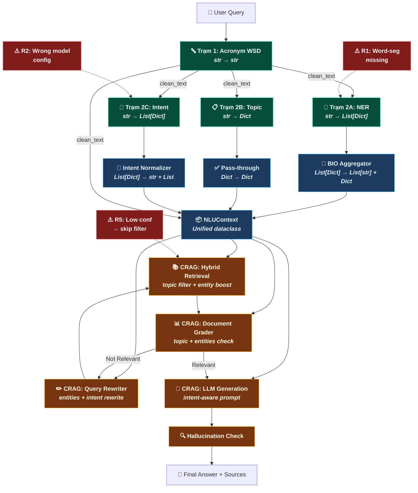

# 🔗 NLU → RAG Integration Blueprint — Chiến lược Hợp nhất Output & Tương thích Pipeline

> **Mục tiêu:** Phân tích I/O schema của 4 model NLU, thiết kế Unified Output, và xác nhận điểm nối vào CRAG pipeline.  
> **Ràng buộc:** Ít thay đổi kiến trúc hiện có nhất. Mọi đề xuất kèm lý do kỹ thuật.

---

## Bước 1 — Phân tích Kiến trúc Hiện tại

### 1.1 I/O Schema Chi tiết của Từng Model

#### Trạm 1: AcronymCrossEncoder

| Thuộc tính | Chi tiết |
|---|---|
| **Class** | `AcronymCrossEncoder(BaseNLUModel)` |
| **Backbone** | `vihealthbert-base-syllable` (RoBERTa, syllable tokenizer) |
| **HF Hub** | `KwanFam26022005/model1-acronym-wsd` |
| **Input** | `str` — raw text từ user |
| **Output** | `str` — clean text (đã thay thế tất cả từ viết tắt) |
| **Output type** | `predict() → str` |
| **Đặc biệt** | Chạy **tuần tự trước** Trạm 2 (vì output là input cho 2A/2B/2C) |

```python
# Ví dụ I/O thực tế
input:  "bs ơi e bị đau dd có cần mổ kt k ạ?"
output: "bác sĩ ơi em bị đau dạ dày có cần mổ kích thước không ạ?"
```

---

#### Trạm 2A: MedicalNER

| Thuộc tính | Chi tiết |
|---|---|
| **Class** | `MedicalNER` (KHÔNG kế thừa `BaseNLUModel`) ⚠️ |
| **Backbone** | `vihealthbert-base-word` + CRF layer (`ViHealthBertCRF`) |
| **HF Hub** | `hoangkhang1628/vihealthbert-crf-medical-ner` |
| **Input** | `str` — clean text (đã word-segment bằng `underthesea`) |
| **Output** | `List[Dict]` — danh sách `{"word": str, "label": str}` |
| **Label schema** | BIO: `O`, `B-SYMPTOM_AND_DISEASE`, `I-SYMPTOM_AND_DISEASE`, `B-MEDICAL_PROCEDURE`, `I-MEDICAL_PROCEDURE`, `B-MEDICINE`, `I-MEDICINE` |
| **Dependency** | Cần import `custom_models.ViHealthBertCRF` |

```python
# Ví dụ I/O thực tế
input:  "bác sĩ ơi em bị đau dạ dày có cần mổ không ạ"
output: [
    {"word": "bác_sĩ", "label": "O"},
    {"word": "đau",    "label": "B-SYMPTOM_AND_DISEASE"},
    {"word": "dạ_dày", "label": "I-SYMPTOM_AND_DISEASE"},
    {"word": "mổ",     "label": "B-MEDICAL_PROCEDURE"},
    ...
]
```

---

#### Trạm 2B: TopicClassifier

| Thuộc tính | Chi tiết |
|---|---|
| **Class** | `TopicClassifier(BaseNLUModel)` |
| **Backbone** | `vihealthbert-base-syllable` + Linear head (18 classes) |
| **HF Hub** | `KwanFam26022005/model2B-topic-classification` |
| **Input** | `str` — clean text |
| **Output** | `Dict` — `{"topic": str, "confidence": float, "is_reliable": bool}` |
| **Label space** | 18 canonical topics: `cardiology`, `gastroenterology`, `pediatrics`, ... |

```python
# Ví dụ I/O thực tế
input:  "em bị đau dạ dày có cần mổ không"
output: {"topic": "gastroenterology", "confidence": 0.9134, "is_reliable": True}
```

---

#### Trạm 2C: IntentClassifier

| Thuộc tính | Chi tiết |
|---|---|
| **Class** | `IntentClassifier` (KHÔNG kế thừa `BaseNLUModel`) ⚠️ |
| **Backbone** | `vihealthbert-base-syllable` (nhưng config trỏ sang NER hub ⚠️) |
| **HF Hub** | `hoangkhang1628/vihealthbert-crf-medical-ner` (⚠️ TRÙNG với NER) |
| **Input** | `str` — clean text |
| **Output** | `List[Dict]` — danh sách `{"intent": str, "score": float}` (multi-label) |
| **Label space** | 4 intents: `Diagnosis`, `Treatment`, `Severity`, `Cause` |
| **Đặc biệt** | Multi-label (sigmoid, dynamic thresholds); fallback nếu không intent nào vượt ngưỡng |

```python
# Ví dụ I/O thực tế
input:  "em bị đau dạ dày có cần mổ không"
output: [
    {"intent": "Treatment", "score": 0.87},
    {"intent": "Diagnosis", "score": 0.62}
]
```

---

### 1.2 Phát hiện Mâu thuẫn & Bất nhất (Incompatibility Audit)

| # | Vấn đề | Nghiêm trọng | Mô tả | Tác động đến RAG |
|---|---|---|---|---|
| **M1** | **Inconsistent base class** | ⚠️ Trung bình | `MedicalNER` và `IntentClassifier` KHÔNG kế thừa `BaseNLUModel` → không có `async_predict()`, `ensure_loaded()` | `main.py` gọi `medical_ner.async_predict()` nhưng `MedicalNER` không có method này → **sẽ crash runtime** |
| **M2** | **NER output format mismatch** | 🔴 Cao | `main.py` type hint `run_ner() → List[str]` nhưng `MedicalNER.predict()` trả về `List[Dict]` (word+label pairs) | RAG cần entity strings, nhưng nhận được raw BIO tokens → **phải aggregate BIO spans** |
| **M3** | **Intent output format mismatch** | 🔴 Cao | `main.py` type hint `run_intent() → Dict[str, Any]` với keys `intents`, `scores`, `primary_intent` nhưng `IntentClassifier.predict()` trả về `List[Dict]` với keys `intent`, `score` | RAG cần `primary_intent: str` để routing prompt, nhưng format khác hoàn toàn |
| **M4** | **Intent model config conflict** | 🔴 Cao | `INTENT_MODEL_DIR` trỏ đến `hoangkhang1628/vihealthbert-crf-medical-ner` — **cùng repo với NER** → Intent đang load **trọng số NER** | Predict sẽ cho kết quả sai hoàn toàn — cần trỏ sang đúng intent model |
| **M5** | **Tokenizer mismatch NER** | ⚠️ Trung bình | NER dùng `vihealthbert-base-word` (cần word-segmentation trước) nhưng `main.py` truyền `clean_text` chưa word-segment | NER sẽ tokenize sai → entity extraction chất lượng kém |
| **M6** | **Missing numpy import** | 🟡 Thấp | `IntentClassifier.predict()` dùng `np.argmax()` nhưng không import `numpy` | Runtime crash khi fallback |
| **M7** | **TopicClassifier dummy mode** | 🟡 Thấp | Khi load từ HF Hub, `TopicClassifier` check `self.model_dir.exists()` — nhưng HF Hub repo ID không phải local path → luôn rơi vào dummy mode | Cần fix logic detect HF Hub vs local path |

### 1.3 Đánh giá Tương thích với CRAG Pipeline

```
              CRAG Pipeline cần                      NLU hiện cung cấp
              ┌─────────────────────┐               ┌─────────────────────┐
              │ clean_text: str     │ ◄──── ✅ ────  │ Trạm 1: str         │
              │                     │               │                     │
              │ topic: str          │ ◄──── ✅ ────  │ Trạm 2B: Dict.topic │
              │ topic_conf: float   │ ◄──── ✅ ────  │ Trạm 2B: Dict.conf  │
              │                     │               │                     │
              │ entities: List[str] │ ◄──── ❌ ────  │ Trạm 2A: List[Dict] │
              │ (aggregated spans)  │     MISMATCH   │ (raw BIO tokens)    │
              │                     │               │                     │
              │ primary_intent: str │ ◄──── ❌ ────  │ Trạm 2C: List[Dict] │
              │ intent_scores: Dict │     MISMATCH   │ (different schema)  │
              └─────────────────────┘               └─────────────────────┘
```

> **Kết luận Bước 1:** Pipeline cần một **Adapter Layer** (NLU Output Normalizer) để bridge gap giữa raw model output và CRAG input contract. Thay đổi tối thiểu: chỉ thêm adapter functions, **không sửa model classes**.

---

## Bước 2 — Thiết kế Chiến lược Merge (Unified NLU Output)

### 2.1 Unified Output Schema — `NLUContext`

Đây là contract duy nhất mà CRAG pipeline nhận:

```python
@dataclass
class NLUContext:
    """Unified output từ toàn bộ NLU Pipeline — input cho CRAG."""
    
    # ── Từ Trạm 1 ──
    raw_text: str                    # Text gốc từ user
    clean_text: str                  # Text đã giải viết tắt
    
    # ── Từ Trạm 2A (NER) ──
    entities: List[str]              # Danh sách entity đã aggregate
                                     # VD: ["đau dạ dày", "mổ nội soi"]
    entity_types: Dict[str, str]     # Entity → type mapping
                                     # VD: {"đau dạ dày": "SYMPTOM_AND_DISEASE"}
    
    # ── Từ Trạm 2B (Topic) ──
    topic: str                       # "gastroenterology"
    topic_confidence: float          # 0.9134
    topic_is_reliable: bool          # True
    
    # ── Từ Trạm 2C (Intent) ──
    primary_intent: str              # "Treatment" (highest score)
    all_intents: List[Dict[str, float]]  # [{"Treatment": 0.87}, ...]
    
    # ── Pipeline metadata ──
    processing_time_ms: float
```

### 2.2 Adapter Functions (Bridge Layer)

Mỗi adapter **KHÔNG sửa model class** — chỉ transform output:

#### Adapter A: NER BIO → Entity Spans

```python
def aggregate_bio_entities(ner_output: List[Dict]) -> Tuple[List[str], Dict[str, str]]:
    """
    Chuyển BIO tokens → entity strings + type mapping.
    
    Input:  [{"word": "đau", "label": "B-SYMPTOM_AND_DISEASE"},
             {"word": "dạ_dày", "label": "I-SYMPTOM_AND_DISEASE"},
             {"word": "mổ", "label": "B-MEDICAL_PROCEDURE"}]
    
    Output: (["đau dạ dày", "mổ"],
             {"đau dạ dày": "SYMPTOM_AND_DISEASE", "mổ": "MEDICAL_PROCEDURE"})
    
    Lý do kỹ thuật: 
    - RAG retrieval cần entity STRINGS để inject vào sparse query
    - RAG prompt cần entity TYPES để phân loại mức độ liên quan
    - BIO scheme phải aggregate B+I* spans thành cụm từ hoàn chỉnh
    """
    entities = []
    entity_types = {}
    current_entity = []
    current_type = None
    
    for token in ner_output:
        label = token["label"]
        word = token["word"].replace("_", " ")  # desegment
        
        if label.startswith("B-"):
            # Save previous entity
            if current_entity:
                entity_str = " ".join(current_entity)
                entities.append(entity_str)
                entity_types[entity_str] = current_type
            # Start new entity
            current_type = label[2:]  # Remove "B-"
            current_entity = [word]
        elif label.startswith("I-") and current_entity:
            current_entity.append(word)
        else:
            # O label → flush current entity
            if current_entity:
                entity_str = " ".join(current_entity)
                entities.append(entity_str)
                entity_types[entity_str] = current_type
                current_entity = []
                current_type = None
    
    # Flush last entity
    if current_entity:
        entity_str = " ".join(current_entity)
        entities.append(entity_str)
        entity_types[entity_str] = current_type
    
    return entities, entity_types
```

#### Adapter B: Intent List → Primary Intent + Scores

```python
def normalize_intent_output(
    intent_output: List[Dict]
) -> Tuple[str, List[Dict[str, float]]]:
    """
    Chuyển List[{"intent": str, "score": float}] → (primary_intent, all_intents).
    
    Input:  [{"intent": "Treatment", "score": 0.87},
             {"intent": "Diagnosis", "score": 0.62}]
    
    Output: ("Treatment", [{"Treatment": 0.87}, {"Diagnosis": 0.62}])
    
    Lý do kỹ thuật:
    - CRAG Query Rewriter cần primary_intent dạng str để chọn prompt template
    - CRAG prompt builder cần all_intents để inject multiple focus areas
    - Sort theo score descending đảm bảo primary luôn là highest confidence
    """
    if not intent_output:
        return "unknown", []
    
    sorted_intents = sorted(intent_output, key=lambda x: x["score"], reverse=True)
    primary = sorted_intents[0]["intent"]
    all_intents = [{item["intent"]: round(item["score"], 4)} for item in sorted_intents]
    
    return primary, all_intents
```

### 2.3 Thứ tự Xử lý & Cơ chế Aggregation

```
┌─────────────────────────────────────────────────────────────────────────────┐
│                    NLU PIPELINE — EXECUTION ORDER                          │
├─────────────────────────────────────────────────────────────────────────────┤
│                                                                           │
│  User Input: "bs ơi e bị đau dd có cần mổ kt k ạ?"                      │
│       │                                                                   │
│       ▼                                                                   │
│  ┌────────────────────────┐                                              │
│  │ PHASE 1 (Sequential)   │                                              │
│  │ Trạm 1: Acronym WSD    │  predict(raw_text) → clean_text             │
│  └───────────┬────────────┘                                              │
│              │ clean_text = "bác sĩ ơi em bị đau dạ dày..."             │
│              │                                                           │
│              ▼                                                           │
│  ┌────────────────────────────────────────────────────┐                  │
│  │ PHASE 2 (Parallel — asyncio.gather)                │                  │
│  │                                                    │                  │
│  │  ┌──────────┐  ┌──────────────┐  ┌──────────────┐ │                  │
│  │  │ 2A: NER  │  │ 2B: Topic    │  │ 2C: Intent   │ │                  │
│  │  │ word-seg │  │ syllable tok │  │ syllable tok │ │                  │
│  │  │ + CRF    │  │ + softmax    │  │ + sigmoid    │ │                  │
│  │  └────┬─────┘  └──────┬───────┘  └──────┬───────┘ │                  │
│  │       │               │                  │         │                  │
│  └───────┼───────────────┼──────────────────┼─────────┘                  │
│          │               │                  │                            │
│          ▼               ▼                  ▼                            │
│  ┌────────────────────────────────────────────────────┐                  │
│  │ PHASE 3: ADAPTER LAYER (Normalization)             │                  │
│  │                                                    │                  │
│  │  NER adapter:     BIO tokens → entity strings      │                  │
│  │  Intent adapter:  List[Dict] → primary + scores    │                  │
│  │  Topic:           pass-through (already normalized)│                  │
│  └───────────────────────┬────────────────────────────┘                  │
│                          │                                               │
│                          ▼                                               │
│  ┌────────────────────────────────────────────────────┐                  │
│  │ PHASE 4: BUILD NLUContext                          │                  │
│  │                                                    │                  │
│  │  NLUContext(                                       │                  │
│  │    raw_text      = "bs ơi e bị đau dd...",        │                  │
│  │    clean_text    = "bác sĩ ơi em bị đau dạ...",   │                  │
│  │    entities      = ["đau dạ dày", "mổ"],          │                  │
│  │    entity_types  = {"đau dạ dày": "SYMPTOM..."},  │                  │
│  │    topic         = "gastroenterology",             │                  │
│  │    topic_conf    = 0.9134,                         │                  │
│  │    primary_intent= "Treatment",                    │                  │
│  │    all_intents   = [{"Treatment": 0.87}, ...],    │                  │
│  │  )                                                │                  │
│  └───────────────────────┬────────────────────────────┘                  │
│                          │                                               │
│                          ▼                                               │
│                 ┌─────────────────┐                                      │
│                 │ CRAG PIPELINE   │ ← NLUContext là INPUT duy nhất       │
│                 └─────────────────┘                                      │
└─────────────────────────────────────────────────────────────────────────────┘
```

### 2.4 Điểm nối vào CRAG Pipeline

`NLUContext` được tiêu thụ tại **4 điểm** trong CRAG:

| # | CRAG Node | Field tiêu thụ | Cách sử dụng |
|---|---|---|---|
| ① | **Hybrid Retrieval** | `clean_text` + `topic` + `entities` | `clean_text` → dense vector; `entities` → sparse boost; `topic` → Qdrant payload filter |
| ② | **Document Grader** | `topic` + `entity_types` | LLM judge prompt: *"Tài liệu này có liên quan đến {topic} và đề cập đến {entities} không?"* |
| ③ | **Query Rewriter** | `entities` + `primary_intent` | Viết lại query: *"Triệu chứng {entities}, bệnh nhân hỏi về {intent}"* |
| ④ | **LLM Generation** | `clean_text` + `primary_intent` + `entity_types` | System prompt routing theo intent; entity highlighting trong context |

---

## Bước 3 — Xác nhận Tương thích & Rủi ro

### 3.1 Verification Matrix — Output Merge → CRAG Input

| CRAG cần | Unified field | Source model | Adapter cần? | Status |
|---|---|---|---|---|
| Query text (sạch) | `clean_text: str` | Trạm 1 | ❌ Pass-through | ✅ **Tương thích** |
| Topic filter key | `topic: str` | Trạm 2B | ❌ Pass-through | ✅ **Tương thích** |
| Confidence gate | `topic_confidence: float` | Trạm 2B | ❌ Pass-through | ✅ **Tương thích** |
| Entity keywords | `entities: List[str]` | Trạm 2A | ✅ BIO aggregator | ✅ Sau adapter |
| Entity semantics | `entity_types: Dict` | Trạm 2A | ✅ BIO aggregator | ✅ Sau adapter |
| Intent routing | `primary_intent: str` | Trạm 2C | ✅ Normalizer | ✅ Sau adapter |
| Multi-intent context | `all_intents: List[Dict]` | Trạm 2C | ✅ Normalizer | ✅ Sau adapter |

### 3.2 Rủi ro Kỹ thuật & Cách Xử lý

| # | Rủi ro | Mức độ | Nguyên nhân | Giải pháp |
|---|---|---|---|---|
| **R1** | NER word-segment mismatch | 🔴 Cao | NER dùng `vihealthbert-word` (cần `underthesea` word-seg) nhưng `main.py` truyền raw text | **Thêm word-segment step** trong adapter NER: `from underthesea import word_tokenize; segmented = word_tokenize(clean_text)` trước khi gọi `ner.predict()` |
| **R2** | Intent model trỏ sai repo | 🔴 Cao | `INTENT_MODEL_DIR` = NER repo → load sai weights | **Fix `config.py`**: trỏ đến đúng intent model repo. Nếu chưa train, dùng fallback heuristic |
| **R3** | Topic fallback dummy mode | ⚠️ TB | HF Hub repo ID không phải local path → `Path.exists()` return False | **Fix `TopicClassifier.load_model()`**: detect HF Hub ID bằng `"/" in str(model_dir)` → dùng `from_pretrained(str(model_dir))` thẳng |
| **R4** | NER entities rỗng | 🟡 Thấp | Câu hỏi quá ngắn hoặc không chứa y tế entities | **Graceful fallback**: CRAG vẫn hoạt động, chỉ bỏ entity boost trong sparse query; dùng `clean_text` as-is |
| **R5** | Topic confidence thấp | 🟡 Thấp | Semantic overlap giữa các khoa (Nội tiết vs Nội khoa) | **Confidence gate**: Nếu `topic_confidence < 0.7` → BỎ topic filter, search toàn bộ corpus. Tránh filter nhầm khoa |
| **R6** | Async mismatch | ⚠️ TB | `MedicalNER` và `IntentClassifier` không có `async_predict()` | **Wrapper**: Thêm `async_predict()` equivalents qua `asyncio.to_thread()` hoặc refactor kế thừa `BaseNLUModel` |
| **R7** | Latency chồng tầng | 🟡 Thấp | NLU (~200ms) + CRAG retrieval + rerank + LLM gen | **Mitigation**: NLU parallel (2A/2B/2C) giữ nguyên; CRAG retry tối đa 2 lần; set timeout 5s cho LLM |

### 3.3 Sơ đồ Tổng thể NLU → Adapter → CRAG



---

## 4. Tóm tắt & Hành Động (Action Items)

### 4.1 Thay đổi cần thiết (sắp xếp theo urgency)

| # | Hành động | File | Urgency | Effort | Mô tả |
|---|---|---|---|---|---|
| 1 | **Fix Intent model config** | `config.py` | 🔴 CRITICAL | 1 dòng | `INTENT_MODEL_DIR` đang trỏ sang NER repo — cần sửa sang đúng intent model |
| 2 | **Tạo `nlu_adapter.py`** | Mới | 🔴 CRITICAL | ~80 dòng | Chứa `aggregate_bio_entities()`, `normalize_intent_output()`, `build_nlu_context()` |
| 3 | **Thêm word-segment cho NER** | `nlu_adapter.py` | 🔴 CRITICAL | ~5 dòng | `from underthesea import word_tokenize` trước khi gọi NER |
| 4 | **Fix TopicClassifier HF detect** | `models.py` | ⚠️ HIGH | ~10 dòng | Thêm logic `"/" in str(model_dir)` để phân biệt HF Hub vs local path |
| 5 | **Thêm async wrapper** | `models.py` | ⚠️ HIGH | ~15 dòng | Cho `MedicalNER` và `IntentClassifier` kế thừa `BaseNLUModel` hoặc wrap `asyncio.to_thread()` |
| 6 | **Tạo `NLUContext` dataclass** | `nlu_adapter.py` | ⚠️ HIGH | ~20 dòng | Unified schema cho CRAG consumption |
| 7 | **Import numpy** | `models.py` | 🟡 LOW | 1 dòng | Thêm `import numpy as np` trong IntentClassifier |

### 4.2 Những gì KHÔNG cần thay đổi

| Component | Lý do giữ nguyên |
|---|---|
| `AcronymCrossEncoder` class | Output `str` đã đúng contract; HF Hub load hoạt động tốt |
| `MedicalNER.predict()` core logic | BIO prediction logic chuẩn; chỉ cần adapter bên ngoài |
| `TopicClassifier.predict()` output | Dict schema đã match CRAG input |
| `main.py` parallel execution model | `asyncio.gather` cho 2A/2B/2C đã tối ưu latency |
| Base pipeline flow (Sequential → Parallel) | Kiến trúc đúng: WSD trước, 3 nhánh sau |

> **Triết lý thiết kế:** Adapter Layer hoạt động như một **anti-corruption layer** (DDD pattern) — cách ly logic model khỏi logic pipeline. Khi model thay đổi output format, chỉ cần sửa adapter, không chạm vào CRAG.
