# 🏗️ System Architecture — Medical NLU Pipeline

> **Dự án:** Hệ thống Hiểu Ngôn ngữ Tự nhiên Y tế (Vietnamese Medical NLU)  
> **Tác giả:** KwanFam  
> **Cập nhật:** 2026-04-01  
> **Backbone chung:** `demdecuong/vihealthbert-base-syllable` (RoBERTa-base, ~135M params)

---

## Sơ đồ 1: TOÀN CẢNH HỆ THỐNG — THE COMPLETE VISION (Production)

Sơ đồ dưới đây thể hiện kiến trúc **End-to-End** khi hệ thống hoàn thiện và đưa vào vận hành thực tế. Luồng dữ liệu đi từ người dùng, qua Backend API, xử lý bởi NLU Pipeline (bộ não lõi), truy xuất tri thức qua RAG, và cuối cùng sinh câu trả lời tự nhiên bằng LLM.

```mermaid
graph TD
    %% ─── STYLING ───
    classDef userNode fill:#1e293b,stroke:#60a5fa,stroke-width:2px,color:#f8fafc,font-weight:bold
    classDef apiNode fill:#0f172a,stroke:#a78bfa,stroke-width:2px,color:#f8fafc,font-weight:bold
    classDef nluNode fill:#064e3b,stroke:#34d399,stroke-width:2px,color:#f0fdf4,font-weight:bold
    classDef ragNode fill:#78350f,stroke:#fbbf24,stroke-width:2px,color:#fefce8,font-weight:bold
    classDef llmNode fill:#581c87,stroke:#c084fc,stroke-width:2px,color:#faf5ff,font-weight:bold
    classDef responseNode fill:#1e293b,stroke:#60a5fa,stroke-width:2px,color:#f8fafc,font-weight:bold
    classDef stationLabel fill:none,stroke:none,color:#94a3b8,font-size:10px

    %% ─── USER LAYER ───
    USER["👤 Bệnh nhân / Người dùng<br/><i>Frontend · Mobile App · Chatbot Widget</i>"]:::userNode

    %% ─── API LAYER ───
    API["⚡ FastAPI Backend<br/><i>POST /analyze_medical_query</i><br/><i>uvicorn · async · Pydantic schema</i>"]:::apiNode

    %% ─── NLU PIPELINE ───
    subgraph NLU_PIPELINE ["🧠 NLU PIPELINE — Bộ não Lõi"]
        direction TB
        S1["🔤 Trạm 1 · Acronym WSD<br/><i>Cross-Encoder · Entity Markers ⟨e⟩</i><br/><i>Hard Negative Mining · BCELoss</i><br/><b>Acc: 91.77% · Unseen: 84.94%</b>"]:::nluNode

        S1 -->|"clean_text<br/>(đã giải viết tắt)"| PARALLEL

        subgraph PARALLEL ["⚡ asyncio.gather — Chạy Song Song"]
            direction LR
            S2A["🏥 Trạm 2A<br/><b>Medical NER</b><br/><i>Token Classification</i><br/><i>BIO Schema</i><br/>Triệu chứng · Thuốc · Thủ thuật"]:::nluNode
            S2B["📋 Trạm 2B<br/><b>Topic Classification</b><br/><i>18 Canonical Topics</i><br/><i>Weighted CE · Pseudo-label</i><br/><b>Acc: ~92.25%</b>"]:::nluNode
            S2C["🎯 Trạm 2C<br/><b>Intent Classification</b><br/><i>Multi-label · Sigmoid</i><br/>Diagnosis · Treatment<br/>Severity · Cause"]:::nluNode
        end
    end

    %% ─── RAG COMPONENT ───
    subgraph RAG_COMPONENT ["📚 RAG — Retrieval-Augmented Generation"]
        direction TB
        QUERY_BUILDER["🔧 Query Builder<br/><i>Tổng hợp: Topic + Entities + Intent</i><br/><i>→ Structured Semantic Query</i>"]:::ragNode
        VECTOR_DB[("🗄️ Vector Database<br/><i>FAISS / Chroma / Qdrant</i><br/><i>CSDL Y khoa · FAQ Vinmec</i><br/><i>Tâm Anh · AloBacsi</i>")]:::ragNode
        RETRIEVER["🔍 Semantic Retriever<br/><i>Top-K Relevant Passages</i><br/><i>Cosine Similarity · MMR</i>"]:::ragNode

        QUERY_BUILDER --> VECTOR_DB
        VECTOR_DB --> RETRIEVER
    end

    %% ─── LLM GENERATION ───
    subgraph LLM_LAYER ["✨ LLM Generation Layer"]
        direction TB
        PROMPT_TEMPLATE["📝 Prompt Engineering<br/><i>System Prompt (Bác sĩ AI)</i><br/><i>+ Retrieved Context</i><br/><i>+ Câu hỏi đã chuẩn hóa</i>"]:::llmNode
        LLM["🤖 Large Language Model<br/><i>Gemini · GPT-4 · Llama 3</i><br/><i>Temperature · Top-P · Safety Filter</i>"]:::llmNode

        PROMPT_TEMPLATE --> LLM
    end

    %% ─── RESPONSE ───
    RESPONSE["💬 Structured JSON Response<br/><i>clean_text · entities · topic · intent</i><br/><i>answer · sources · confidence</i><br/><i>processing_time_ms</i>"]:::responseNode

    %% ─── FLOW CONNECTIONS ───
    USER -->|"HTTP Request<br/>raw_text"| API
    API -->|"text thô"| S1
    PARALLEL -->|"NLU Result<br/>{entities, topic, intent}"| QUERY_BUILDER
    RETRIEVER -->|"Top-K Passages<br/>+ Metadata"| PROMPT_TEMPLATE
    S1 -.->|"clean_text"| PROMPT_TEMPLATE
    LLM -->|"Generated Answer"| RESPONSE
    RESPONSE -->|"HTTP Response"| USER

    %% ─── SUBGRAPH STYLING ───
    style NLU_PIPELINE fill:#022c22,stroke:#34d399,stroke-width:3px,color:#34d399,font-weight:bold
    style PARALLEL fill:#064e3b,stroke:#6ee7b7,stroke-width:1px,stroke-dasharray:5 5,color:#6ee7b7
    style RAG_COMPONENT fill:#451a03,stroke:#fbbf24,stroke-width:3px,color:#fbbf24,font-weight:bold
    style LLM_LAYER fill:#3b0764,stroke:#c084fc,stroke-width:3px,color:#c084fc,font-weight:bold
```

### Giải thích Luồng Hoạt động

- **Tiền xử lý tuần tự (Sequential):** Câu hỏi thô từ người dùng **bắt buộc** đi qua Trạm 1 (Acronym WSD) trước tiên để chuẩn hóa các từ viết tắt y tế (`kt → kích thước`, `XQ → X-quang`). Đây là bước tiên quyết vì các trạm sau cần input sạch để hoạt động chính xác.

- **Xử lý song song (Parallel):** Sau khi có `clean_text`, ba nhánh NLU — **NER** (trích xuất thực thể), **Topic** (phân loại chuyên khoa), **Intent** (phân loại ý định) — được khởi chạy đồng thời qua `asyncio.gather`, tối ưu latency tổng thể xuống mức gần bằng thời gian của nhánh chậm nhất.

- **RAG — Truy xuất tri thức có ngữ cảnh:** Kết quả NLU (topic, entities, intent) được **Query Builder** tổng hợp thành câu truy vấn ngữ nghĩa có cấu trúc, dùng để tìm kiếm các đoạn văn y khoa liên quan nhất trong Vector Database (chứa hàng nghìn cặp FAQ và tài liệu lâm sàng đã được embedding sẵn).

- **LLM — Sinh câu trả lời tự nhiên:** Prompt được thiết kế kết hợp 3 yếu tố: *System Prompt* (vai trò bác sĩ AI), *Retrieved Context* (bằng chứng y khoa), và *Câu hỏi đã chuẩn hóa*. LLM (Gemini/GPT/Llama) sinh câu trả lời tự nhiên, chính xác và có trích dẫn nguồn — sau đó đóng gói vào JSON response trả về cho người dùng.

---

## Sơ đồ 2: GIAI ĐOẠN HIỆN TẠI — CURRENT STATE (Data Engineering & Model Training)

Sơ đồ dưới đây **"Zoom kỹ"** vào toàn bộ công việc đã hoàn thành: từ thu thập dữ liệu thô, qua các bước xử lý và kỹ thuật nâng cao, đến sản xuất ra các mô hình fine-tuned đạt chuẩn SOTA.

```mermaid
graph TD
    %% ─── STYLING ───
    classDef rawData fill:#1e3a5f,stroke:#38bdf8,stroke-width:2px,color:#e0f2fe,font-weight:bold
    classDef process fill:#1a1a2e,stroke:#818cf8,stroke-width:2px,color:#e0e7ff,font-weight:bold
    classDef technique fill:#3b1f2b,stroke:#f472b6,stroke-width:2px,color:#fce7f3,font-weight:bold
    classDef model fill:#052e16,stroke:#4ade80,stroke-width:2px,color:#dcfce7,font-weight:bold
    classDef output fill:#422006,stroke:#fb923c,stroke-width:2px,color:#ffedd5,font-weight:bold
    classDef metric fill:#1a1a2e,stroke:#a78bfa,stroke-width:1px,color:#c4b5fd,font-style:italic

    %% ════════════════════════════════════════════
    %% RAW DATA SOURCES
    %% ════════════════════════════════════════════
    subgraph DATA_SOURCES ["📦 Nguồn Dữ liệu Thô — Raw Data Sources"]
        direction LR
        VINMEC[("🏥 Vinmec<br/><i>train_ml.csv</i><br/><b>&gt;60% tổng data</b><br/><i>FAQ + Bệnh án</i>")]:::rawData
        TAMANH[("🏥 Tâm Anh<br/><i>ml_training_data_tamanh.csv</i><br/><b>~30% tổng data</b><br/><i>Ca bệnh chuyên sâu</i>")]:::rawData
        ALOBACSI[("🏥 AloBacsi<br/><i>alobacsi_processed.csv</i><br/><b>&lt;10% tổng data</b><br/><i>Hỏi đáp bình dân</i>")]:::rawData
        ACRDRAID[("📄 acrDrAid<br/><i>LREC 2022 Dataset</i><br/><b>135 acronyms</b><br/><i>424 expansions</i>")]:::rawData
    end

    %% ════════════════════════════════════════════
    %% STATION 1: ACRONYM DISAMBIGUATION
    %% ════════════════════════════════════════════
    subgraph STATION_1 ["🔤 TRẠM 1 — Acronym Word Sense Disambiguation"]
        direction TB

        ACR_RAW["📥 Raw JSON<br/><i>data.json + dictionary.json</i><br/><i>Train: 2,678 · Dev: 523 · Test: 1,130</i>"]:::process

        ENTITY_MARK["✏️ Entity Marking<br/><i>Chèn ⟨e⟩acronym⟨/e⟩</i><br/><i>Cho Transformer biết vị trí focus</i>"]:::technique

        HNM["⚔️ Hard Negative Mining<br/><i>1 Positive + N Negatives / sample</i><br/><i>Dictionary Lookup → Candidate Pairs</i><br/><b>2,678 → 10,638 cặp câu</b><br/><i>(×4 Data Explosion)</i>"]:::technique

        ACR_TOKENIZE["🔡 Sentence-Pair Encoding<br/><i>[CLS] marked_ctx [SEP] candidate [SEP]</i><br/><i>truncation = only_first</i><br/><i>max_length = 256</i>"]:::process

        ACR_MODEL["🧠 Cross-Encoder<br/><i>ViHealthBERT-Syllable</i><br/><i>12 Transformer Layers → [CLS]</i><br/><i>Linear(768, 1) → BCEWithLogitsLoss</i>"]:::model

        ACR_TRAIN["🏋️ Training Strategy<br/><i>Differential LR: Enc 2e-5 · Head 1e-4</i><br/><i>FP16 · Grad Accum 4 · Cosine Anneal</i><br/><i>Early Stopping patience=5</i>"]:::technique

        ACR_RESULT["🏆 Kết quả<br/><b>Overall Acc: 91.77%</b><br/><b>Unseen Acc: 84.94%</b><br/><b>MRR: 0.9533</b>"]:::output

        ACR_DEPLOY["📦 HuggingFace Hub<br/><i>KwanFam26022005/model1-acronym-wsd</i><br/><i>.safetensors + tokenizer + dict</i>"]:::output

        ACR_RAW --> ENTITY_MARK
        ENTITY_MARK --> HNM
        HNM --> ACR_TOKENIZE
        ACR_TOKENIZE --> ACR_MODEL
        ACR_MODEL --> ACR_TRAIN
        ACR_TRAIN --> ACR_RESULT
        ACR_RESULT --> ACR_DEPLOY
    end

    %% ════════════════════════════════════════════
    %% STATION 2B: TOPIC CLASSIFICATION
    %% ════════════════════════════════════════════
    subgraph STATION_2B ["📋 TRẠM 2B — Medical Topic Classification"]
        direction TB

        TOPIC_RAW["📥 Raw CSV (3 nguồn)<br/><i>Vinmec + Tâm Anh + AloBacsi</i><br/><i>39 nhãn gốc · phân mảnh nặng</i>"]:::process

        PREPROCESS["🧹 Tiền xử lý<br/><i>NFC normalize · Loại HTML/boilerplate</i><br/><i>Xóa tiền tố hội thoại</i><br/><i>Desegment dấu _ từ word-seg</i>"]:::process

        CANONICAL["🗺️ Canonical Mapping<br/><i>39 nhãn → 18 nhãn chuẩn</i><br/><i>neurosurgery → neurology</i><br/><i>hepatology → gastroenterology</i><br/><i>neonatology → pediatrics</i><br/><b>DROP nhãn quá hiếm / ngoài phạm vi</b>"]:::technique

        SPLIT["📊 Stratified Split<br/><i>→ topic_train.json</i><br/><i>→ topic_val.json</i><br/><i>→ topic_test.json</i><br/><i>+ topic_label_map.json</i>"]:::process

        %% ── PHASE 2: SELF-TRAINING ──
        subgraph SELF_TRAINING ["🔄 Phase 2 — Self-Training (FAQ Augmentation)"]
            direction TB
            FAQ_RAW["📄 Kho FAQ thô<br/><i>~10K câu hỏi không nhãn</i><br/><i>Đa dạng diễn đạt bệnh nhân</i>"]:::rawData
            TEACHER["👨‍🏫 Teacher Model<br/><i>Model Topic v1 (đã train Phase 1)</i><br/><i>Quét toàn bộ FAQ → Pseudo-label</i>"]:::model
            DOUBLE_FILTER["🔬 Double Filter<br/><i>① Softmax Confidence ≥ 0.95</i><br/><i>② Chỉ TARGET minority classes</i><br/><i>(ent, dermatology, endocrinology...)</i><br/><b>Van an toàn chống Imbalance Amplification</b>"]:::technique
            MERGE["📎 Merge → Train Set<br/><i>topic_train_augmented.json</i><br/><i>Bổ sung mẫu chất lượng cao</i><br/><i>cho các khoa thiểu số</i>"]:::process

            FAQ_RAW --> TEACHER
            TEACHER --> DOUBLE_FILTER
            DOUBLE_FILTER --> MERGE
        end

        %% ── TRAINING ──
        WEIGHT_CALC["⚖️ Class Weight Computation<br/><i>w_c = N / (C × N_c)</i><br/><i>Imbalance Ratio: 159.2×</i><br/><i>Sản: 2,548 vs Dinh dưỡng: 16</i>"]:::technique

        TOPIC_MODEL["🧠 ViHealthBERT + Head(18)<br/><i>Syllable Tokenizer · Dynamic Padding</i><br/><i>DataCollatorWithPadding</i><br/><i>Weighted Cross-Entropy Loss</i>"]:::model

        TOPIC_TRAIN["🏋️ WeightedTrainer<br/><i>HuggingFace Trainer API</i><br/><i>Best ckpt theo Validation F1</i><br/><i>Hold-out Test evaluation</i>"]:::technique

        TOPIC_EVAL["📊 Evaluation Strategy<br/><i>Macro-F1 + Per-class F1</i><br/><i>Phát hiện 'lớp bị bỏ rơi'</i><br/><i>Confusion Analysis giữa khoa gần</i>"]:::process

        TOPIC_RESULT["🏆 Kết quả<br/><b>Overall Acc: ~92.25%</b><br/><i>18 Canonical Topics</i><br/><i>Robust trên đa nguồn</i>"]:::output

        TOPIC_RAW --> PREPROCESS
        PREPROCESS --> CANONICAL
        CANONICAL --> SPLIT
        SPLIT --> WEIGHT_CALC
        MERGE --> WEIGHT_CALC
        WEIGHT_CALC --> TOPIC_MODEL
        TOPIC_MODEL --> TOPIC_TRAIN
        TOPIC_TRAIN --> TOPIC_EVAL
        TOPIC_EVAL --> TOPIC_RESULT
    end

    %% ════════════════════════════════════════════
    %% DATA SOURCE CONNECTIONS
    %% ════════════════════════════════════════════
    ACRDRAID -->|"acrDrAid Dataset"| ACR_RAW
    VINMEC -->|"train_ml.csv"| TOPIC_RAW
    TAMANH -->|"ml_training_data"| TOPIC_RAW
    ALOBACSI -->|"alobacsi_processed"| TOPIC_RAW

    %% ════════════════════════════════════════════
    %% SUBGRAPH STYLING
    %% ════════════════════════════════════════════
    style DATA_SOURCES fill:#0c1929,stroke:#38bdf8,stroke-width:3px,color:#38bdf8,font-weight:bold
    style STATION_1 fill:#071a0e,stroke:#4ade80,stroke-width:3px,color:#4ade80,font-weight:bold
    style STATION_2B fill:#1a0e07,stroke:#fb923c,stroke-width:3px,color:#fb923c,font-weight:bold
    style SELF_TRAINING fill:#2d1215,stroke:#f472b6,stroke-width:2px,stroke-dasharray:5 5,color:#f472b6
```

### Giải thích Luồng Hoạt động

- **Trạm 1 — Acronym WSD (Cross-Encoder):** Dữ liệu thô từ bộ `acrDrAid` (2,678 mẫu gốc) đi qua bước **Entity Marking** (đánh dấu vị trí từ viết tắt bằng `⟨e⟩`/`⟨/e⟩`), sau đó qua **Hard Negative Mining** để nhân bản thành 10,638 cặp câu. Mô hình Cross-Encoder (ViHealthBERT + Linear(768,1)) được huấn luyện với `BCEWithLogitsLoss`, đạt **91.77% accuracy** tổng thể và đáng chú ý nhất là **84.94% trên từ viết tắt chưa từng thấy** — chứng minh khả năng Zero-shot Generalization.

- **Trạm 2B — Topic Classification (Self-Training Pipeline):** Dữ liệu 3 nguồn (Vinmec, Tâm Anh, AloBacsi) được gộp, chuẩn hóa, và ánh xạ từ **39 nhãn phân mảnh** về **18 nhãn chuẩn** (Canonical Mapping). Để đối phó với tỷ lệ mất cân bằng **159.2×**, pipeline triển khai song song hai vũ khí: **(1) Weighted Cross-Entropy** (trọng số nghịch đảo tần suất) và **(2) Self-Training bằng FAQ Pseudo-labeling** với bộ lọc kép (Confidence ≥ 0.95 AND chỉ bổ sung cho khoa thiểu số).

- **Triết lý thiết kế chung:** Cả hai trạm đều chia sẻ backbone **ViHealthBERT-Syllable** (pre-trained trên 3GB+ dữ liệu y tế Việt Nam), nhưng sử dụng Classification Head hoàn toàn khác biệt: Trạm 1 là **Binary Scorer** (1 output, so cặp), Trạm 2B là **Multi-class Classifier** (18 outputs, mutually exclusive). Thiết kế modular này cho phép deploy và cập nhật từng trạm độc lập mà không ảnh hưởng pipeline.

- **Đảm bảo chất lượng (Quality Assurance):** Trạm 1 đo lường bằng **MRR** + **Unseen Accuracy** (khả năng suy luận trên từ viết tắt lạ). Trạm 2B đo bằng **Macro-F1** + **Per-class F1** để phát hiện sớm hiện tượng "lớp bị bỏ rơi" — hai metric này bổ trợ lẫn nhau, đảm bảo hệ thống hoạt động đồng đều trên mọi chuyên khoa.

---

## Bảng Tổng hợp Trạng thái Các Module

| Module | Trạng thái | Kiến trúc | Kết quả chính |
|--------|-----------|-----------|---------------|
| **Trạm 1** — Acronym WSD | ✅ Hoàn thành & Deployed | Cross-Encoder · BCEWithLogitsLoss | Acc 91.77% · Unseen 84.94% |
| **Trạm 2A** — Medical NER | 🔲 Dự kiến | Token Classification · BIO Schema | — |
| **Trạm 2B** — Topic Classification | ✅ Hoàn thành | Multi-class · Weighted CE · Self-Training | Acc ~92.25% |
| **Trạm 2C** — Intent Classification | 🔲 Dự kiến | Multi-label · Sigmoid · 4 Intents | — |
| **RAG + LLM** | 🔮 Tương lai | Vector DB + LLM Generation | — |
