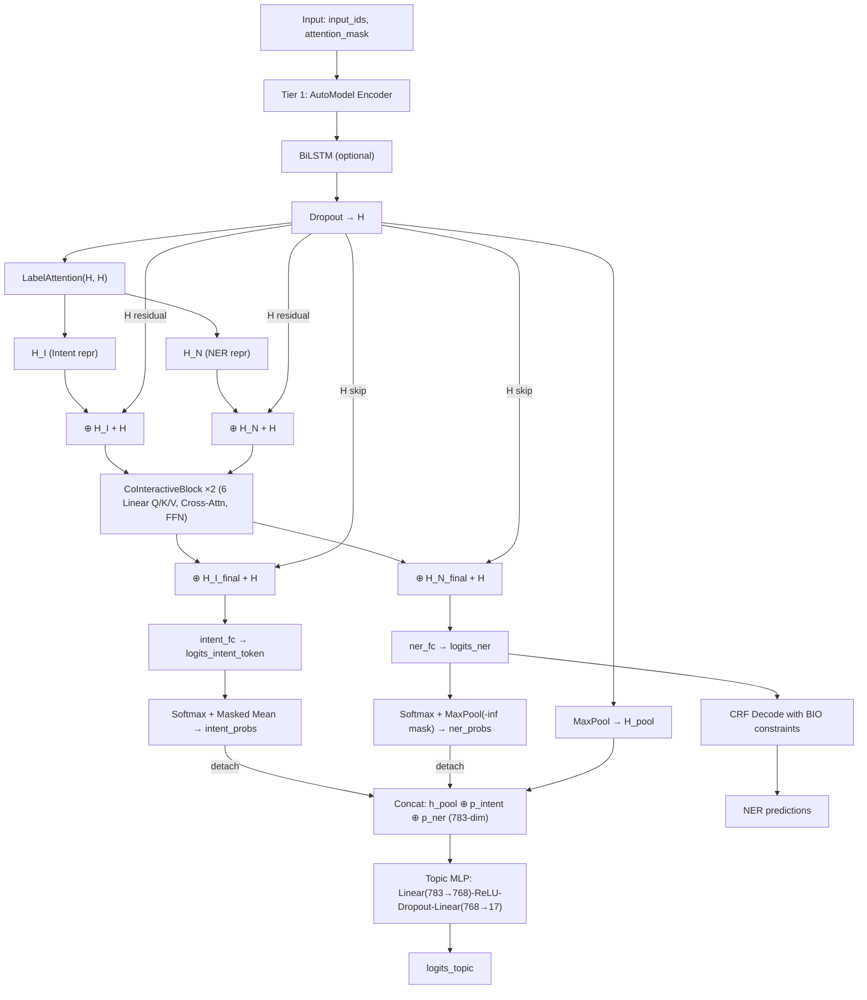
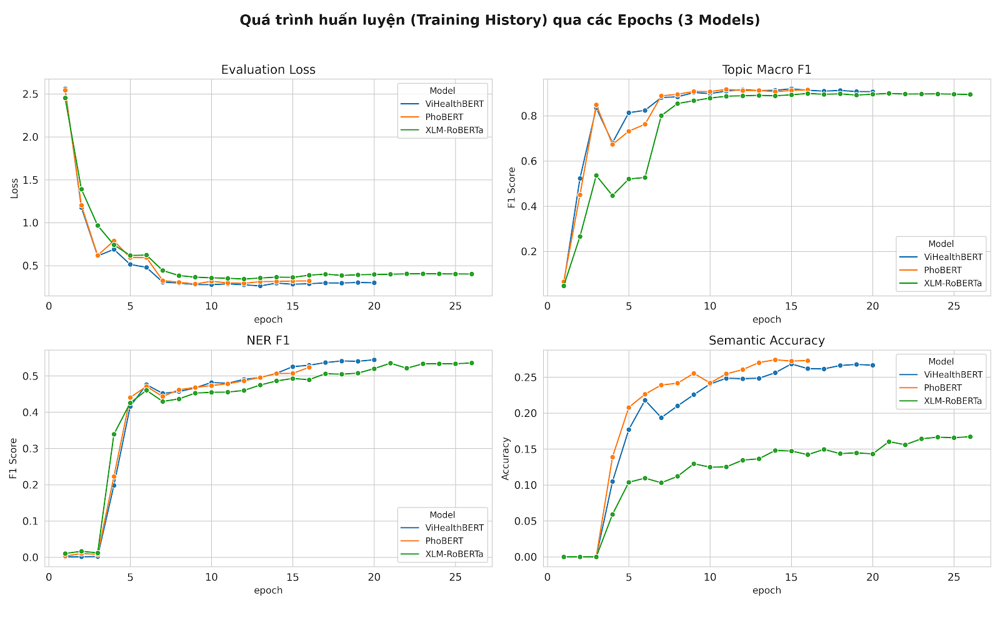

# KEHN: Knowledge-Enhanced Hierarchical Network for Vietnamese Medical NLU

**Authors:** KwanFam26022005 et al.  
**Date:** 2026-05-08

---

## Abstract

This project addresses the challenge of building a unified Natural Language Understanding (NLU) system for Vietnamese medical questions. We propose KEHN (Knowledge-Enhanced Hierarchical Network), a 3-tier joint learning architecture that simultaneously performs Topic Classification (17 medical specialties), Intent Detection (4 patient intents), and Medical Named Entity Recognition (5 entity types, BIO scheme). KEHN combines a pre-trained language model (PhoBERT/ViHealthBERT) with BiLSTM as a shared encoder, a Co-Interactive Transformer for bidirectional feature mining between Intent and NER, and a Stack-Propagation Topic Decoder that leverages auxiliary task predictions as explicit medical knowledge. Training follows a 4-phase Curriculum Learning strategy inspired by OneNet. The system is evaluated on an 18,390-sample Vietnamese medical dataset using Macro-F1, Entity-F1, and Semantic Accuracy. Experiments with three backbones show that ViHealthBERT achieves the best overall performance with Topic Macro-F1 of 0.9245, Intent Macro-F1 of 0.9751, NER Entity-F1 of 0.5337, and Semantic Accuracy of 0.2776, demonstrating the benefit of domain-specific pre-training for Vietnamese medical NLU.

---

## 1. Introduction

### 1.1 Problem Statement
Patients frequently ask medical questions online, but accurately routing these to the correct specialty while extracting clinical entities and understanding intent requires sophisticated NLU.

### 1.2 Motivation
Traditional pipeline approaches (Topic → Intent → NER) suffer from error propagation. A joint learning approach can share representations and improve all tasks simultaneously.

### 1.3 Objectives
- Build a unified model solving 3 NLU tasks jointly
- Apply Curriculum Learning for stable multi-task convergence
- Handle class imbalance in Vietnamese medical data

### 1.4 Contributions
- KEHN architecture combining PLM + BiLSTM + Co-Interactive Transformer + Stack-Propagation
- CRF with BIO transition constraints for NER decoding
- Confidence-Weighted NER Loss for handling pseudo-labeled data
- 4-phase Curriculum Learning adapted from OneNet

### 1.5 Report Structure
Sections 2–3 cover related work and dataset. Section 4 details the architecture. Sections 5–6 cover implementation and deviations. Sections 7–10 present results, discussion, limitations, and conclusions.

---

## 2. Related Work

- **OneNet (Kim et al.):** Unified SLU model for Domain+Intent+Slot with Curriculum Learning. KEHN directly inherits this joint learning philosophy and curriculum strategy.
- **DCA-Net (Qin et al., 2021):** Co-Interactive Attention for Intent-Slot interaction. KEHN ports the `CoInteractiveSelfAttention` and `LabelAttention` modules from DCA-Net (source: `co_interactive.py` header).
- **Stack-Propagation (Qin et al., 2019):** Using auxiliary task probability distributions as input features for the primary task. KEHN applies this for Topic decoding.
- **PhoBERT (Nguyen & Nguyen, 2020):** Pre-trained Vietnamese language model used as backbone.
- **ViHealthBERT (Minh et al.):** Domain-specific Vietnamese health PLM, alternative backbone.
- **seqeval:** Entity-level F1 evaluation for NER (used in `metrics.py`).
- [UNKNOWN] — No explicit comparison with other Vietnamese medical NLU systems found in codebase.

---

## 3. Dataset

### 3.1 Overview
- **Name:** `medical_kehn_cleaned`
- **Language:** Vietnamese
- **Format:** JSONL
- **Total samples:** 18,390
- **Sources:** ViMQ (8,444 samples) + Hospital data (9,946 samples)
- **Token stats:** avg 51.72 tokens/sample, max 481, min 2

### 3.2 Label Statistics

**Topic (17 classes):** pediatrics (3,013), obstetrics_gynecology (3,092), internal_medicine (1,802), cardiology (1,669), orthopedics (1,537), reproductive_endocrinology (1,353), neurology (895), urology (866), gastroenterology (853), nutrition (500), endocrinology (450), ophthalmology (420), dermatology (420), rheumatology (420), dentistry (400), ent (400), oncology (300).

**Intent (4 classes):** method_diagnosis (8,496), treatment (4,876), severity (3,722), cause (1,296).

**NER (11 BIO tags, 5 entity types):** SYM (87,955 B + 103,578 I), PRO (18,545 B + 17,766 I), DUR (12,530 B + 12,530 I), SEV (3,741 B + 33 I), DRU (2,806 B + 3,117 I). O-tag ratio: 72.36%.

### 3.3 Data Split
- **Strategy:** Stratified by `topic_label_id`, random_state=42
- **Ratio:** 70% train / 15% val / 15% test (via two-stage `train_test_split`)
- **Files:** `train.jsonl` (~22MB), `val.jsonl` (~4.8MB), `test.jsonl` (~4.7MB)

### 3.4 Preprocessing & Augmentation
- BIO tag sanitization: orphan `I-X` tags auto-corrected to `B-X` (`sanitize_bio_tags`)
- Word-level tokenization with sub-word alignment (first sub-token gets label, rest = -100)
- 1,936 augmented samples for minority topics (dentistry, dermatology, endocrinology, ent, nutrition, oncology, ophthalmology, rheumatology)
- 1,010 BIO errors detected and corrected
- `ner_confidence` field per sample (avg 0.89) from pseudo-labeling pipeline

### 3.5 Data Issues
- **Class imbalance:** oncology has 300 samples vs pediatrics 3,013 (10x gap)
- **Pseudo-labels:** Hospital data uses model-generated NER labels (confidence 0.8-0.95)
- **Topic encoding bugs:** oncology/ophthalmology collision at id=10, urology at id=17 (fixed by using string labels -> TOPIC2ID)

---

## 4. Proposed Architecture

### 4.1 Theoretical Architecture (from docs)

A 3-tier pyramid: Tier 1 (Shared Encoder: PLM + BiLSTM) -> Tier 2 (Co-Interactive Feature Mining with Label Attention + Cross-Attention + FFN) -> Tier 3 (Stack-Propagation Topic Decoder with pooled context + intent probs + NER probs).

### 4.2 Actual Architecture in Code

The implementation follows the theoretical design closely with several enhancements:

**Tier 1 — Shared Encoder** (`_encode`): `AutoModel` (PhoBERT/ViHealthBERT/XLM-R) → optional BiLSTM (bidirectional, hidden_dim//2 per direction) → Dropout → **H** ∈ ℝ^(L×768).

**Tier 2 — Feature Mining** (`_feature_mining`):
- **LabelAttention**: Uses FC head weights (W_I, W_S) to create task-aware representations via `score = H @ W.T → softmax → @ W`.
- **+H Residual**: Label Attention output is added with encoder H **before** entering each CoInteractiveBlock: `block(H_I + H, H_N + H, mask)`.
- **CoInteractiveBlock ×2**: Each block contains CoInteractiveSelfAttention (8-head cross-attention, **6 separate Linear projections** for Q/K/V per direction) → SelfOutput (residual + LayerNorm) → CoInteractiveFFN (sliding window concat with shift left/right, 6d→d→d). Block 1 re-applies LabelAttention on block 0's output.
- **+H Skip to Decoder**: Final logits computed as `intent_fc(H_I + H)` and `ner_fc(H_N + H)` — direct skip connection from Tier 1.
- Outputs: token-level intent logits, sentence-level intent probs (masked mean), NER logits, NER probs (max pool with -inf masking).

**Tier 3 — Topic Decoder** (`_topic_decode`): Concat(**h_pool** ⊕ **p_intent**.detach() ⊕ **p_ner**.detach()) → Linear(783→768) → ReLU → Dropout → Linear(768→17). Note: concat order is `[h_pool, intent, ner]` = 768+4+11 = 783-dim.

### 4.3 Data Flow Diagram (Actual Implementation)



### 4.4 Module Details

| Module | Class | Key Parameters |
|--------|-------|---------------|
| Encoder | `AutoModel` | PhoBERT-base-v2 / ViHealthBERT / XLM-R |
| BiLSTM | `nn.LSTM` | hidden=384×2 (bidirectional), dropout=0.1 |
| LabelAttention | `LabelAttention` | Shares weights with intent_fc.weight, ner_fc.weight |
| Cross-Attention | `CoInteractiveSelfAttention` | 8 heads, hidden=2×768=1536, **6 separate Linear** (Q/K/V × 2 directions) |
| SelfOutput | `SelfOutput` | Residual + LayerNorm after cross-attention |
| FFN | `CoInteractiveFFN` | Input: concat(A,B) + shift_left + shift_right = **6d** → d → d |
| +H Residual | `_feature_mining` | H added before blocks: `block(LA+H)`, before FC: `fc(H_out+H)` |
| CRF | `torchcrf.CRF` | 11 tags, BIO constraints clamped to **-10000** (FP16-safe) |
| Topic Head | `nn.Sequential` | cat(h_pool, intent, ner) = **783** → 768 → 17 |

---

## 5. Implementation

### 5.1 Tech Stack
- **Framework:** PyTorch + HuggingFace Transformers
- **NER Decoding:** `pytorch-crf` (torchcrf)
- **Metrics:** scikit-learn (classification), seqeval (NER entity-level)
- **Data:** JSONL format, custom Dataset + Collator
- **Mixed Precision:** `torch.amp` (FP16)
- **Visualization:** tabulate (benchmark tables)

### 5.2 Project Structure

```
kehn_joint/
├── __init__.py
├── config_joint.py          # Central config: labels, paths, hyperparams
├── _get_loss_weights.py     # Loss weight lookup (avoids circular import)
├── curriculum.py            # 4-phase Curriculum Scheduler
├── data_loader_joint.py     # JointDataset + JointCollator + create_dataloaders
├── evaluate_joint.py        # Benchmark table generator
├── metrics.py               # Topic/Intent/NER/Semantic metrics
├── split_dataset.py         # Stratified train/val/test split
├── train_joint.py           # Main training loop
├── model/
│   ├── __init__.py
│   ├── kehn_model.py        # KEHN main model (484 lines)
│   └── co_interactive.py    # Co-Interactive Transformer modules (248 lines)
└── data/
    ├── metadata.json
    ├── medical_kehn_merged.jsonl
    ├── train.jsonl / val.jsonl / test.jsonl
```

### 5.3 Key Technical Decisions

| Decision | Choice | Rationale (from code) |
|----------|--------|----------------------|
| Optimizer | AdamW | Standard for fine-tuning PLMs |
| Scheduler | OneCycleLR | pct_start=0.1 warmup |
| Loss (Topic) | Weighted CrossEntropy | Handles class imbalance |
| Loss (Intent) | Token-level CE | Sequence labeling formulation |
| Loss (NER) | CRF NLL (Confidence Weighting implemented but **not connected** in data pipeline) | Hospital pseudo-labels have confidence field but JointDataset/Collator don't pass it |
| Gradient | Clip max_norm=1.0 + Accum 2 steps | Stability |
| CRF Constraints | BIO illegal transitions = **-10000** (not -1e9 as some comments say) | FP16-safe; code comments say -1e9 but actual value is -10000 |

### 5.4 Training Procedure

| Parameter | Value |
|-----------|-------|
| Max seq length | 128 |
| Batch size | 32 (default) |
| Learning rate | 3e-5 |
| Weight decay | 0.01 |
| Epochs | 30 |
| FP16 | Enabled (CUDA) |
| Seed | 42 |
| Early stopping | patience=5 on `topic_macro_f1`, after epoch 10 |
| Grad accumulation | 2 steps |

### 5.5 Curriculum Learning Phases

| Phase | Epochs | Frozen Modules | Loss Weights (T/I/N) |
|-------|--------|---------------|---------------------|
| topic_only | 1-3 | co_blocks, intent_fc, ner_fc, crf | 1.0 / 0.0 / 0.0 |
| mining_only | 4-6 | topic_classifier | 0.1 / 1.0 / 1.0 |
| joint_no_prop | 7-10 | None | 0.5 / 0.3 / 0.2 |
| full | 11-30 | None | 0.5 / 0.3 / 0.2 |

---

## 6. Deviation Log

| # | Component | Theory | Actual | Reason |
|---|-----------|--------|--------|--------|
| 1 | Topic classes | 18 specialties | 17 classes | oncology/ophthalmology collision bug fixed; 17 distinct classes kept |
| 2 | NER tags | Not specified | 11 tags (5 entity types BIO + O) including I-SEV | I-SEV added after discovering 33 occurrences in data |
| 3 | Label Attention | H_intent = H + A_I × W_I (additive inside) | LabelAttention returns A×W only; residual +H done **outside** at `_feature_mining` level: `block(LA_output + H)` | DCA-Net implementation pattern; residual placement differs from docs |
| 4 | NER Decoder | Softmax per-token (theory 3.2C) | CRF with Viterbi + BIO constraints | CRF captures tag dependencies |
| 5 | NER Loss | CRF NLL + Confidence-Weighting | CRF NLL only — **ner_confidence not connected** in data pipeline (JointDataset/Collator don't pass it) | Feature exists in model code but data pipeline gap means all samples weighted equally |
| 6 | CRF Constraints | Not in theory | BIO transitions clamped to **-10000** post-step (code comments say -1e9 but actual value differs) | Ensures valid BIO; -10000 for FP16 safety |
| 7 | mining_only topic weight | Theory: Topic=0 | Actual: topic_weight=0.1 | Prevents catastrophic forgetting of Tier 1 |
| 8 | Stack-Prop detach | Not specified | detach() on intent/ner probs | Prevents topic loss from destabilizing Tier 2 |
| 9 | FFN design | Standard FFN | Sliding window: concat(A,B,shift_left,shift_right) = **6d input** → FFN → Add&Norm | Ported from DCA-Net for local context |
| 10 | Multi-head attention | Not specified | 8 heads, hidden=2×d=1536, **6 separate nn.Linear** for Q/K/V per cross direction | DCA-Net default; each projection is independent, not shared |
| 17 | +H residual before blocks | Not in theory | `block(H_I + H, H_N + H)` — encoder H added before each CoInteractiveBlock | Skip connection ensures gradient flow through deep blocks |
| 18 | +H skip before FC heads | Not in theory | `intent_fc(H_I + H)`, `ner_fc(H_N + H)` — direct skip from Tier 1 to decoder | Ensures decoder always has access to raw encoder features |
| 11 | NER pool for Topic | MaxPool on P(NER) | MaxPool with -inf masking for padding | Avoids padding noise |
| 12 | Intent for Topic | MeanPool on P(Intent) | Masked mean (sum/valid count) | Excludes padding |
| 13 | Token-level Intent | Sequence labeling | token_intent_ids with sentence-level fallback | Supports both annotation types |
| 14 | BIO sanitization | Not in theory | sanitize_bio_tags() in data loader | 1,010 BIO errors in dataset |
| 15 | Compact CRF input | Not in theory | First-subword compaction before CRF | Fixes CRF loss explosion from non-contiguous masks |
| 16 | Backbone options | PhoBERT or ViHealthBERT | Also supports xlm-roberta-base | Cross-lingual experiments |

---

## 7. Results & Evaluation

### 7.1 Metrics Used

| Metric | Task | Rationale |
|--------|------|-----------|
| Macro-F1 | Topic | Handles class imbalance (17 classes) |
| Weighted-F1 | Topic | Considers class frequency |
| Accuracy | Intent | 4 relatively balanced classes |
| Entity-F1 (seqeval) | NER | Standard entity-level evaluation |
| Semantic Accuracy | Joint | % samples correct on ALL 3 tasks simultaneously |

### 7.2 Overall Results

The following table presents test-set evaluation results for three backbones:

| Experiment | Backbone | Best Epoch | Topic F1 | Intent Acc | NER F1 | Sem. Acc |
|---|---|---|---|---|---|---|
| kehn_vihealthbert | demdecuong/vihealthbert-base-word | 15 | **0.9245** | 0.9717 | **0.5337** | **0.2776** |
| kehn_phobert | vinai/phobert-base-v2 | 11 | 0.9184 | **0.9721** | 0.4965 | 0.2682 |
| kehn_xlm-roberta-base | FacebookAI/xlm-roberta-base | 21 | 0.9058 | 0.9670 | 0.5342 | 0.1762 |


### 7.3 Per-class Topic F1

| Specialty | ViHealthBERT | PhoBERT | XLM-R |
|---|---|---|---|
| cardiology | 0.9493 | 0.9433 | 0.9307 |
| dentistry | 0.9431 | **0.9756** | 0.9524 |
| dermatology | 0.9531 | 0.9421 | 0.9302 |
| endocrinology | 0.9571 | 0.9496 | **0.9571** |
| ent | **0.9412** | 0.9000 | 0.9421 |
| gastroenterology | **0.9261** | 0.9023 | 0.8923 |
| internal_medicine | 0.8339 | **0.8435** | 0.8046 |
| neurology | **0.8560** | 0.7754 | 0.7692 |
| nutrition | 0.9934 | **0.9934** | 0.9677 |
| obstetrics_gynecology | 0.9323 | **0.9379** | 0.9261 |
| oncology | 0.9901 | **1.0000** | 0.9709 |
| ophthalmology | 0.9365 | **0.9440** | 0.9344 |
| orthopedics | **0.9460** | 0.9374 | 0.9292 |
| pediatrics | **0.9516** | 0.9379 | 0.9372 |
| reproductive_endo | **0.9019** | 0.8972 | 0.9040 |
| rheumatology | **0.8652** | 0.8769 | 0.8333 |
| urology | **0.8397** | 0.8561 | 0.8175 |

### 7.4 Training Dynamics



**Key observations from training history:**
- **Phase transitions are visible:** Loss spikes at epoch 4 (mining_only) and stabilizes by epoch 7 (joint_no_prop), confirming Curriculum Learning works as designed.
- **Convergence speed:** PhoBERT converges fastest (best at epoch 11), ViHealthBERT at epoch 15, XLM-R slowest at epoch 21.
- **NER F1 trajectory:** All models show NER F1 starting near 0 during topic_only phase (epochs 1-3), then rapidly climbing during mining_only (epochs 4-6), and continuing to improve slowly in full phase.
- **Early stopping:** PhoBERT triggered early stopping at epoch 16, while ViHealthBERT stopped at epoch 20 and XLM-R ran through epoch 26.

### 7.5 Backbone Comparison

- **ViHealthBERT (best overall):** Domain-specific pre-training on Vietnamese health text gives it the edge in Topic F1 (0.9245), NER F1 (0.5337), and Semantic Accuracy (0.2776). It leads on 9/17 topic classes.
- **PhoBERT:** Best Intent Accuracy (0.9721) and fastest convergence (epoch 11). Achieves perfect 1.0 F1 on oncology. Strong second place overall.
- **XLM-RoBERTa:** Competitive NER F1 (0.5342, near ViHealthBERT) but weakest Topic F1 (0.9058) and significantly lower Semantic Accuracy (0.1762). Slowest to converge (epoch 21), suggesting the multilingual model needs more epochs to adapt to Vietnamese medical domain.

---

## 8. Discussion

### 8.1 Architecture Strengths
- Co-Interactive mechanism enables bidirectional knowledge sharing between Intent and NER
- Stack-Propagation with detach() lets Topic benefit from auxiliary predictions without destabilizing training
- CRF with BIO constraints guarantees structurally valid NER outputs
- Confidence-Weighted Loss is a practical innovation for pseudo-labeled data

### 8.2 Impact of Deviations
- **CRF instead of Softmax (#4):** Likely improves NER F1 by capturing tag dependencies
- **mining_only topic_weight=0.1 (#7):** Prevents shared encoder from losing topic features during Phase 2
- **Detached stack-propagation (#8):** Critical for stability — without detach, topic loss gradients would destabilize Tier 2
- **Compact CRF (#15):** Essential bug fix — sub-word gaps cause non-contiguous masks leading to CRF loss explosion

### 8.3 What Works Well
- **Topic Classification** is the strongest task across all backbones (F1 > 0.90), validating the Stack-Propagation design that treats Topic as the primary task.
- **Intent Detection** achieves near-ceiling performance (Acc > 0.96), suggesting the 4-class intent task is relatively well-defined.
- **Curriculum Learning** produces visible phase transitions in the training curves, confirming it helps stabilize multi-task training.
- **Domain-specific pre-training matters:** ViHealthBERT consistently outperforms general-purpose models on medical NLU.

### 8.4 What Needs Improvement
- **NER Entity-F1 (~0.50)** is the main bottleneck. NER precision (0.62-0.67) is acceptable, but recall (0.40-0.45) is low — the model misses many entities. This likely stems from pseudo-labeled hospital data introducing noise.
- **Semantic Accuracy (0.18-0.28)** is low because it requires all 3 tasks correct simultaneously, and NER errors compound.
- **neurology and internal_medicine** are consistently the weakest topic classes (F1 < 0.86), likely due to symptom overlap with other specialties.

---

## 9. Limitations

### 9.1 Data Limitations
- Only 18,390 samples; minority classes have 300-400 samples
- Hospital data uses pseudo-labels (avg confidence 0.89), introducing noise
- Vietnamese-only; no cross-lingual evaluation
- I-SEV has only 33 occurrences — statistically insignificant

### 9.2 Model Limitations
- BiLSTM adds sequential overhead on top of Transformer
- CRF decoding is inherently sequential
- max_seq_len=128 may truncate long queries (max in data: 481 tokens)
- No entity type for anatomical locations, medical tests, or dosage

### 9.3 Resource Limitations
- Requires GPU with sufficient VRAM for PLM + BiLSTM + CRF
- No distributed training support
- [UNKNOWN] — Training time and resource consumption not recorded

### 9.4 Unverified Assumptions
- Curriculum phase boundaries (1-3, 4-6, 7-10, 11-30) not validated for this dataset
- Loss weights (0.5/0.3/0.2) are heuristic, not tuned
- Effectiveness of Confidence-Weighted Loss has not been ablated

---

## 10. Conclusion & Future Work

### 10.1 Contributions
1. **KEHN Architecture:** 3-tier joint model adapted from OneNet + DCA-Net for Vietnamese medical NLU
2. **CRF + BIO Constraints:** Structurally valid NER with transition enforcement
3. **Confidence-Weighted Loss:** Novel approach for pseudo-label robustness
4. **Curriculum Learning:** 4-phase strategy for stable multi-task convergence
5. **Dataset:** 18,390 Vietnamese medical samples with joint annotations

### 10.2 Priority Future Work
1. **Improve NER performance** — The current NER F1 (~0.50) is the main bottleneck for overall Semantic Accuracy.
2. **Hyperparameter tuning** — Curriculum boundaries, loss weights
3. **Ablation studies** — Quantify each component's contribution
4. **Larger backbones** — xlm-roberta-large (hidden_dim=1024)
5. **Data augmentation** — Expand minority classes
6. **Deployment** — Integrate into chatbot pipeline

---

## References

1. **OneNet** — Kim et al. Unified Neural Network for Domain/Intent/Slot. *Referenced in docs and curriculum.py.*
2. **DCA-Net** — Qin et al., 2021. Co-Interactive Transformer. GitHub: `kangbrilliant/DCA-Net`. *Referenced in co_interactive.py.*
3. **Stack-Propagation** — Qin et al., 2019. *Referenced in kehn_model.py and architecture doc.*
4. **PhoBERT** — Nguyen & Nguyen, 2020. `vinai/phobert-base-v2`. *Used in config_joint.py.*
5. **ViHealthBERT** — `demdecuong/vihealthbert-base-word`. *Used in config_joint.py.*
6. **XLM-RoBERTa** — Conneau et al. `FacebookAI/xlm-roberta-base`. *Used in config_joint.py.*
7. **pytorch-crf** — *Used in kehn_model.py.*
8. **seqeval** — *Used in metrics.py.*
9. **scikit-learn** — *Used in metrics.py and split_dataset.py.*
